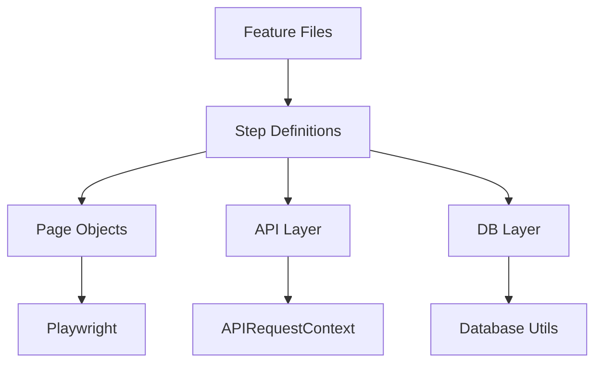
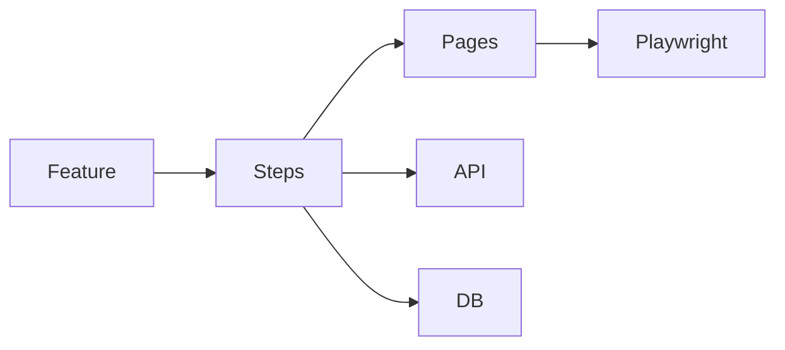

# Mock Interview Questions and Answers – 250 QAs (2–5 Years Experience)

This document contains detailed interview questions and answers based on the latest Playwright + TypeScript + Cucumber BDD automation framework with API, UI, DB, CI/CD and performance testing capabilities.

## Framework Architecture Diagram

## Q1. Explain aspect 1 of your automation framework implementation.

Answer:
In the implemented framework we use Playwright with TypeScript and Cucumber BDD to automate UI, API and database validations in a single unified framework. The framework follows layered architecture including Feature Files, Step Definitions, Page Objects, Utilities, Configuration and CI/CD integration. Data is shared between steps using dependency injection and Playwright fixtures. Tests are executed in parallel across desktop and mobile browsers with Allure reporting, Docker support and GitHub Actions pipelines. Environment-based configuration and a generic database layer allow end‑to‑end validation from API to UI to DB.

## Q2. Explain aspect 2 of your automation framework implementation.

Answer:
In the implemented framework we use Playwright with TypeScript and Cucumber BDD to automate UI, API and database validations in a single unified framework. The framework follows layered architecture including Feature Files, Step Definitions, Page Objects, Utilities, Configuration and CI/CD integration. Data is shared between steps using dependency injection and Playwright fixtures. Tests are executed in parallel across desktop and mobile browsers with Allure reporting, Docker support and GitHub Actions pipelines. Environment-based configuration and a generic database layer allow end‑to‑end validation from API to UI to DB.

## Q3. Explain aspect 3 of your automation framework implementation.

Answer:
In the implemented framework we use Playwright with TypeScript and Cucumber BDD to automate UI, API and database validations in a single unified framework. The framework follows layered architecture including Feature Files, Step Definitions, Page Objects, Utilities, Configuration and CI/CD integration. Data is shared between steps using dependency injection and Playwright fixtures. Tests are executed in parallel across desktop and mobile browsers with Allure reporting, Docker support and GitHub Actions pipelines. Environment-based configuration and a generic database layer allow end‑to‑end validation from API to UI to DB.

## Q4. Explain aspect 4 of your automation framework implementation.

Answer:
In the implemented framework we use Playwright with TypeScript and Cucumber BDD to automate UI, API and database validations in a single unified framework. The framework follows layered architecture including Feature Files, Step Definitions, Page Objects, Utilities, Configuration and CI/CD integration. Data is shared between steps using dependency injection and Playwright fixtures. Tests are executed in parallel across desktop and mobile browsers with Allure reporting, Docker support and GitHub Actions pipelines. Environment-based configuration and a generic database layer allow end‑to‑end validation from API to UI to DB.

## Q5. Explain aspect 5 of your automation framework implementation.

Answer:
In the implemented framework we use Playwright with TypeScript and Cucumber BDD to automate UI, API and database validations in a single unified framework. The framework follows layered architecture including Feature Files, Step Definitions, Page Objects, Utilities, Configuration and CI/CD integration. Data is shared between steps using dependency injection and Playwright fixtures. Tests are executed in parallel across desktop and mobile browsers with Allure reporting, Docker support and GitHub Actions pipelines. Environment-based configuration and a generic database layer allow end‑to‑end validation from API to UI to DB.

## Q6. Explain aspect 6 of your automation framework implementation.

Answer:
In the implemented framework we use Playwright with TypeScript and Cucumber BDD to automate UI, API and database validations in a single unified framework. The framework follows layered architecture including Feature Files, Step Definitions, Page Objects, Utilities, Configuration and CI/CD integration. Data is shared between steps using dependency injection and Playwright fixtures. Tests are executed in parallel across desktop and mobile browsers with Allure reporting, Docker support and GitHub Actions pipelines. Environment-based configuration and a generic database layer allow end‑to‑end validation from API to UI to DB.

## Q7. Explain aspect 7 of your automation framework implementation.

Answer:
In the implemented framework we use Playwright with TypeScript and Cucumber BDD to automate UI, API and database validations in a single unified framework. The framework follows layered architecture including Feature Files, Step Definitions, Page Objects, Utilities, Configuration and CI/CD integration. Data is shared between steps using dependency injection and Playwright fixtures. Tests are executed in parallel across desktop and mobile browsers with Allure reporting, Docker support and GitHub Actions pipelines. Environment-based configuration and a generic database layer allow end‑to‑end validation from API to UI to DB.

## Q8. Explain aspect 8 of your automation framework implementation.

Answer:
In the implemented framework we use Playwright with TypeScript and Cucumber BDD to automate UI, API and database validations in a single unified framework. The framework follows layered architecture including Feature Files, Step Definitions, Page Objects, Utilities, Configuration and CI/CD integration. Data is shared between steps using dependency injection and Playwright fixtures. Tests are executed in parallel across desktop and mobile browsers with Allure reporting, Docker support and GitHub Actions pipelines. Environment-based configuration and a generic database layer allow end‑to‑end validation from API to UI to DB.

## Q9. Explain aspect 9 of your automation framework implementation.

Answer:
In the implemented framework we use Playwright with TypeScript and Cucumber BDD to automate UI, API and database validations in a single unified framework. The framework follows layered architecture including Feature Files, Step Definitions, Page Objects, Utilities, Configuration and CI/CD integration. Data is shared between steps using dependency injection and Playwright fixtures. Tests are executed in parallel across desktop and mobile browsers with Allure reporting, Docker support and GitHub Actions pipelines. Environment-based configuration and a generic database layer allow end‑to‑end validation from API to UI to DB.

## Q10. Explain aspect 10 of your automation framework implementation.

Answer:
In the implemented framework we use Playwright with TypeScript and Cucumber BDD to automate UI, API and database validations in a single unified framework. The framework follows layered architecture including Feature Files, Step Definitions, Page Objects, Utilities, Configuration and CI/CD integration. Data is shared between steps using dependency injection and Playwright fixtures. Tests are executed in parallel across desktop and mobile browsers with Allure reporting, Docker support and GitHub Actions pipelines. Environment-based configuration and a generic database layer allow end‑to‑end validation from API to UI to DB.

## Q11. Explain aspect 11 of your automation framework implementation.

Answer:
In the implemented framework we use Playwright with TypeScript and Cucumber BDD to automate UI, API and database validations in a single unified framework. The framework follows layered architecture including Feature Files, Step Definitions, Page Objects, Utilities, Configuration and CI/CD integration. Data is shared between steps using dependency injection and Playwright fixtures. Tests are executed in parallel across desktop and mobile browsers with Allure reporting, Docker support and GitHub Actions pipelines. Environment-based configuration and a generic database layer allow end‑to‑end validation from API to UI to DB.

## Q12. Explain aspect 12 of your automation framework implementation.

Answer:
In the implemented framework we use Playwright with TypeScript and Cucumber BDD to automate UI, API and database validations in a single unified framework. The framework follows layered architecture including Feature Files, Step Definitions, Page Objects, Utilities, Configuration and CI/CD integration. Data is shared between steps using dependency injection and Playwright fixtures. Tests are executed in parallel across desktop and mobile browsers with Allure reporting, Docker support and GitHub Actions pipelines. Environment-based configuration and a generic database layer allow end‑to‑end validation from API to UI to DB.

## Q13. Explain aspect 13 of your automation framework implementation.

Answer:
In the implemented framework we use Playwright with TypeScript and Cucumber BDD to automate UI, API and database validations in a single unified framework. The framework follows layered architecture including Feature Files, Step Definitions, Page Objects, Utilities, Configuration and CI/CD integration. Data is shared between steps using dependency injection and Playwright fixtures. Tests are executed in parallel across desktop and mobile browsers with Allure reporting, Docker support and GitHub Actions pipelines. Environment-based configuration and a generic database layer allow end‑to‑end validation from API to UI to DB.

## Q14. Explain aspect 14 of your automation framework implementation.

Answer:
In the implemented framework we use Playwright with TypeScript and Cucumber BDD to automate UI, API and database validations in a single unified framework. The framework follows layered architecture including Feature Files, Step Definitions, Page Objects, Utilities, Configuration and CI/CD integration. Data is shared between steps using dependency injection and Playwright fixtures. Tests are executed in parallel across desktop and mobile browsers with Allure reporting, Docker support and GitHub Actions pipelines. Environment-based configuration and a generic database layer allow end‑to‑end validation from API to UI to DB.

## Q15. Explain aspect 15 of your automation framework implementation.

Answer:
In the implemented framework we use Playwright with TypeScript and Cucumber BDD to automate UI, API and database validations in a single unified framework. The framework follows layered architecture including Feature Files, Step Definitions, Page Objects, Utilities, Configuration and CI/CD integration. Data is shared between steps using dependency injection and Playwright fixtures. Tests are executed in parallel across desktop and mobile browsers with Allure reporting, Docker support and GitHub Actions pipelines. Environment-based configuration and a generic database layer allow end‑to‑end validation from API to UI to DB.

## Q16. Explain aspect 16 of your automation framework implementation.

Answer:
In the implemented framework we use Playwright with TypeScript and Cucumber BDD to automate UI, API and database validations in a single unified framework. The framework follows layered architecture including Feature Files, Step Definitions, Page Objects, Utilities, Configuration and CI/CD integration. Data is shared between steps using dependency injection and Playwright fixtures. Tests are executed in parallel across desktop and mobile browsers with Allure reporting, Docker support and GitHub Actions pipelines. Environment-based configuration and a generic database layer allow end‑to‑end validation from API to UI to DB.

## Q17. Explain aspect 17 of your automation framework implementation.

Answer:
In the implemented framework we use Playwright with TypeScript and Cucumber BDD to automate UI, API and database validations in a single unified framework. The framework follows layered architecture including Feature Files, Step Definitions, Page Objects, Utilities, Configuration and CI/CD integration. Data is shared between steps using dependency injection and Playwright fixtures. Tests are executed in parallel across desktop and mobile browsers with Allure reporting, Docker support and GitHub Actions pipelines. Environment-based configuration and a generic database layer allow end‑to‑end validation from API to UI to DB.

## Q18. Explain aspect 18 of your automation framework implementation.

Answer:
In the implemented framework we use Playwright with TypeScript and Cucumber BDD to automate UI, API and database validations in a single unified framework. The framework follows layered architecture including Feature Files, Step Definitions, Page Objects, Utilities, Configuration and CI/CD integration. Data is shared between steps using dependency injection and Playwright fixtures. Tests are executed in parallel across desktop and mobile browsers with Allure reporting, Docker support and GitHub Actions pipelines. Environment-based configuration and a generic database layer allow end‑to‑end validation from API to UI to DB.

## Q19. Explain aspect 19 of your automation framework implementation.

Answer:
In the implemented framework we use Playwright with TypeScript and Cucumber BDD to automate UI, API and database validations in a single unified framework. The framework follows layered architecture including Feature Files, Step Definitions, Page Objects, Utilities, Configuration and CI/CD integration. Data is shared between steps using dependency injection and Playwright fixtures. Tests are executed in parallel across desktop and mobile browsers with Allure reporting, Docker support and GitHub Actions pipelines. Environment-based configuration and a generic database layer allow end‑to‑end validation from API to UI to DB.

## Q20. Explain aspect 20 of your automation framework implementation.

Answer:
In the implemented framework we use Playwright with TypeScript and Cucumber BDD to automate UI, API and database validations in a single unified framework. The framework follows layered architecture including Feature Files, Step Definitions, Page Objects, Utilities, Configuration and CI/CD integration. Data is shared between steps using dependency injection and Playwright fixtures. Tests are executed in parallel across desktop and mobile browsers with Allure reporting, Docker support and GitHub Actions pipelines. Environment-based configuration and a generic database layer allow end‑to‑end validation from API to UI to DB.

## Q21. Explain aspect 21 of your automation framework implementation.

Answer:
In the implemented framework we use Playwright with TypeScript and Cucumber BDD to automate UI, API and database validations in a single unified framework. The framework follows layered architecture including Feature Files, Step Definitions, Page Objects, Utilities, Configuration and CI/CD integration. Data is shared between steps using dependency injection and Playwright fixtures. Tests are executed in parallel across desktop and mobile browsers with Allure reporting, Docker support and GitHub Actions pipelines. Environment-based configuration and a generic database layer allow end‑to‑end validation from API to UI to DB.

## Q22. Explain aspect 22 of your automation framework implementation.

Answer:
In the implemented framework we use Playwright with TypeScript and Cucumber BDD to automate UI, API and database validations in a single unified framework. The framework follows layered architecture including Feature Files, Step Definitions, Page Objects, Utilities, Configuration and CI/CD integration. Data is shared between steps using dependency injection and Playwright fixtures. Tests are executed in parallel across desktop and mobile browsers with Allure reporting, Docker support and GitHub Actions pipelines. Environment-based configuration and a generic database layer allow end‑to‑end validation from API to UI to DB.

## Q23. Explain aspect 23 of your automation framework implementation.

Answer:
In the implemented framework we use Playwright with TypeScript and Cucumber BDD to automate UI, API and database validations in a single unified framework. The framework follows layered architecture including Feature Files, Step Definitions, Page Objects, Utilities, Configuration and CI/CD integration. Data is shared between steps using dependency injection and Playwright fixtures. Tests are executed in parallel across desktop and mobile browsers with Allure reporting, Docker support and GitHub Actions pipelines. Environment-based configuration and a generic database layer allow end‑to‑end validation from API to UI to DB.

## Q24. Explain aspect 24 of your automation framework implementation.

Answer:
In the implemented framework we use Playwright with TypeScript and Cucumber BDD to automate UI, API and database validations in a single unified framework. The framework follows layered architecture including Feature Files, Step Definitions, Page Objects, Utilities, Configuration and CI/CD integration. Data is shared between steps using dependency injection and Playwright fixtures. Tests are executed in parallel across desktop and mobile browsers with Allure reporting, Docker support and GitHub Actions pipelines. Environment-based configuration and a generic database layer allow end‑to‑end validation from API to UI to DB.

## Q25. Explain aspect 25 of your automation framework implementation.

Answer:
In the implemented framework we use Playwright with TypeScript and Cucumber BDD to automate UI, API and database validations in a single unified framework. The framework follows layered architecture including Feature Files, Step Definitions, Page Objects, Utilities, Configuration and CI/CD integration. Data is shared between steps using dependency injection and Playwright fixtures. Tests are executed in parallel across desktop and mobile browsers with Allure reporting, Docker support and GitHub Actions pipelines. Environment-based configuration and a generic database layer allow end‑to‑end validation from API to UI to DB.

### Supporting Diagram

## Q26. Explain aspect 26 of your automation framework implementation.

Answer:
In the implemented framework we use Playwright with TypeScript and Cucumber BDD to automate UI, API and database validations in a single unified framework. The framework follows layered architecture including Feature Files, Step Definitions, Page Objects, Utilities, Configuration and CI/CD integration. Data is shared between steps using dependency injection and Playwright fixtures. Tests are executed in parallel across desktop and mobile browsers with Allure reporting, Docker support and GitHub Actions pipelines. Environment-based configuration and a generic database layer allow end‑to‑end validation from API to UI to DB.

## Q27. Explain aspect 27 of your automation framework implementation.

Answer:
In the implemented framework we use Playwright with TypeScript and Cucumber BDD to automate UI, API and database validations in a single unified framework. The framework follows layered architecture including Feature Files, Step Definitions, Page Objects, Utilities, Configuration and CI/CD integration. Data is shared between steps using dependency injection and Playwright fixtures. Tests are executed in parallel across desktop and mobile browsers with Allure reporting, Docker support and GitHub Actions pipelines. Environment-based configuration and a generic database layer allow end‑to‑end validation from API to UI to DB.

## Q28. Explain aspect 28 of your automation framework implementation.

Answer:
In the implemented framework we use Playwright with TypeScript and Cucumber BDD to automate UI, API and database validations in a single unified framework. The framework follows layered architecture including Feature Files, Step Definitions, Page Objects, Utilities, Configuration and CI/CD integration. Data is shared between steps using dependency injection and Playwright fixtures. Tests are executed in parallel across desktop and mobile browsers with Allure reporting, Docker support and GitHub Actions pipelines. Environment-based configuration and a generic database layer allow end‑to‑end validation from API to UI to DB.

## Q29. Explain aspect 29 of your automation framework implementation.

Answer:
In the implemented framework we use Playwright with TypeScript and Cucumber BDD to automate UI, API and database validations in a single unified framework. The framework follows layered architecture including Feature Files, Step Definitions, Page Objects, Utilities, Configuration and CI/CD integration. Data is shared between steps using dependency injection and Playwright fixtures. Tests are executed in parallel across desktop and mobile browsers with Allure reporting, Docker support and GitHub Actions pipelines. Environment-based configuration and a generic database layer allow end‑to‑end validation from API to UI to DB.

## Q30. Explain aspect 30 of your automation framework implementation.

Answer:
In the implemented framework we use Playwright with TypeScript and Cucumber BDD to automate UI, API and database validations in a single unified framework. The framework follows layered architecture including Feature Files, Step Definitions, Page Objects, Utilities, Configuration and CI/CD integration. Data is shared between steps using dependency injection and Playwright fixtures. Tests are executed in parallel across desktop and mobile browsers with Allure reporting, Docker support and GitHub Actions pipelines. Environment-based configuration and a generic database layer allow end‑to‑end validation from API to UI to DB.

## Q31. Explain aspect 31 of your automation framework implementation.

Answer:
In the implemented framework we use Playwright with TypeScript and Cucumber BDD to automate UI, API and database validations in a single unified framework. The framework follows layered architecture including Feature Files, Step Definitions, Page Objects, Utilities, Configuration and CI/CD integration. Data is shared between steps using dependency injection and Playwright fixtures. Tests are executed in parallel across desktop and mobile browsers with Allure reporting, Docker support and GitHub Actions pipelines. Environment-based configuration and a generic database layer allow end‑to‑end validation from API to UI to DB.

## Q32. Explain aspect 32 of your automation framework implementation.

Answer:
In the implemented framework we use Playwright with TypeScript and Cucumber BDD to automate UI, API and database validations in a single unified framework. The framework follows layered architecture including Feature Files, Step Definitions, Page Objects, Utilities, Configuration and CI/CD integration. Data is shared between steps using dependency injection and Playwright fixtures. Tests are executed in parallel across desktop and mobile browsers with Allure reporting, Docker support and GitHub Actions pipelines. Environment-based configuration and a generic database layer allow end‑to‑end validation from API to UI to DB.

## Q33. Explain aspect 33 of your automation framework implementation.

Answer:
In the implemented framework we use Playwright with TypeScript and Cucumber BDD to automate UI, API and database validations in a single unified framework. The framework follows layered architecture including Feature Files, Step Definitions, Page Objects, Utilities, Configuration and CI/CD integration. Data is shared between steps using dependency injection and Playwright fixtures. Tests are executed in parallel across desktop and mobile browsers with Allure reporting, Docker support and GitHub Actions pipelines. Environment-based configuration and a generic database layer allow end‑to‑end validation from API to UI to DB.

## Q34. Explain aspect 34 of your automation framework implementation.

Answer:
In the implemented framework we use Playwright with TypeScript and Cucumber BDD to automate UI, API and database validations in a single unified framework. The framework follows layered architecture including Feature Files, Step Definitions, Page Objects, Utilities, Configuration and CI/CD integration. Data is shared between steps using dependency injection and Playwright fixtures. Tests are executed in parallel across desktop and mobile browsers with Allure reporting, Docker support and GitHub Actions pipelines. Environment-based configuration and a generic database layer allow end‑to‑end validation from API to UI to DB.

## Q35. Explain aspect 35 of your automation framework implementation.

Answer:
In the implemented framework we use Playwright with TypeScript and Cucumber BDD to automate UI, API and database validations in a single unified framework. The framework follows layered architecture including Feature Files, Step Definitions, Page Objects, Utilities, Configuration and CI/CD integration. Data is shared between steps using dependency injection and Playwright fixtures. Tests are executed in parallel across desktop and mobile browsers with Allure reporting, Docker support and GitHub Actions pipelines. Environment-based configuration and a generic database layer allow end‑to‑end validation from API to UI to DB.

## Q36. Explain aspect 36 of your automation framework implementation.

Answer:
In the implemented framework we use Playwright with TypeScript and Cucumber BDD to automate UI, API and database validations in a single unified framework. The framework follows layered architecture including Feature Files, Step Definitions, Page Objects, Utilities, Configuration and CI/CD integration. Data is shared between steps using dependency injection and Playwright fixtures. Tests are executed in parallel across desktop and mobile browsers with Allure reporting, Docker support and GitHub Actions pipelines. Environment-based configuration and a generic database layer allow end‑to‑end validation from API to UI to DB.

## Q37. Explain aspect 37 of your automation framework implementation.

Answer:
In the implemented framework we use Playwright with TypeScript and Cucumber BDD to automate UI, API and database validations in a single unified framework. The framework follows layered architecture including Feature Files, Step Definitions, Page Objects, Utilities, Configuration and CI/CD integration. Data is shared between steps using dependency injection and Playwright fixtures. Tests are executed in parallel across desktop and mobile browsers with Allure reporting, Docker support and GitHub Actions pipelines. Environment-based configuration and a generic database layer allow end‑to‑end validation from API to UI to DB.

## Q38. Explain aspect 38 of your automation framework implementation.

Answer:
In the implemented framework we use Playwright with TypeScript and Cucumber BDD to automate UI, API and database validations in a single unified framework. The framework follows layered architecture including Feature Files, Step Definitions, Page Objects, Utilities, Configuration and CI/CD integration. Data is shared between steps using dependency injection and Playwright fixtures. Tests are executed in parallel across desktop and mobile browsers with Allure reporting, Docker support and GitHub Actions pipelines. Environment-based configuration and a generic database layer allow end‑to‑end validation from API to UI to DB.

## Q39. Explain aspect 39 of your automation framework implementation.

Answer:
In the implemented framework we use Playwright with TypeScript and Cucumber BDD to automate UI, API and database validations in a single unified framework. The framework follows layered architecture including Feature Files, Step Definitions, Page Objects, Utilities, Configuration and CI/CD integration. Data is shared between steps using dependency injection and Playwright fixtures. Tests are executed in parallel across desktop and mobile browsers with Allure reporting, Docker support and GitHub Actions pipelines. Environment-based configuration and a generic database layer allow end‑to‑end validation from API to UI to DB.

## Q40. Explain aspect 40 of your automation framework implementation.

Answer:
In the implemented framework we use Playwright with TypeScript and Cucumber BDD to automate UI, API and database validations in a single unified framework. The framework follows layered architecture including Feature Files, Step Definitions, Page Objects, Utilities, Configuration and CI/CD integration. Data is shared between steps using dependency injection and Playwright fixtures. Tests are executed in parallel across desktop and mobile browsers with Allure reporting, Docker support and GitHub Actions pipelines. Environment-based configuration and a generic database layer allow end‑to‑end validation from API to UI to DB.

## Q41. Explain aspect 41 of your automation framework implementation.

Answer:
In the implemented framework we use Playwright with TypeScript and Cucumber BDD to automate UI, API and database validations in a single unified framework. The framework follows layered architecture including Feature Files, Step Definitions, Page Objects, Utilities, Configuration and CI/CD integration. Data is shared between steps using dependency injection and Playwright fixtures. Tests are executed in parallel across desktop and mobile browsers with Allure reporting, Docker support and GitHub Actions pipelines. Environment-based configuration and a generic database layer allow end‑to‑end validation from API to UI to DB.

## Q42. Explain aspect 42 of your automation framework implementation.

Answer:
In the implemented framework we use Playwright with TypeScript and Cucumber BDD to automate UI, API and database validations in a single unified framework. The framework follows layered architecture including Feature Files, Step Definitions, Page Objects, Utilities, Configuration and CI/CD integration. Data is shared between steps using dependency injection and Playwright fixtures. Tests are executed in parallel across desktop and mobile browsers with Allure reporting, Docker support and GitHub Actions pipelines. Environment-based configuration and a generic database layer allow end‑to‑end validation from API to UI to DB.

## Q43. Explain aspect 43 of your automation framework implementation.

Answer:
In the implemented framework we use Playwright with TypeScript and Cucumber BDD to automate UI, API and database validations in a single unified framework. The framework follows layered architecture including Feature Files, Step Definitions, Page Objects, Utilities, Configuration and CI/CD integration. Data is shared between steps using dependency injection and Playwright fixtures. Tests are executed in parallel across desktop and mobile browsers with Allure reporting, Docker support and GitHub Actions pipelines. Environment-based configuration and a generic database layer allow end‑to‑end validation from API to UI to DB.

## Q44. Explain aspect 44 of your automation framework implementation.

Answer:
In the implemented framework we use Playwright with TypeScript and Cucumber BDD to automate UI, API and database validations in a single unified framework. The framework follows layered architecture including Feature Files, Step Definitions, Page Objects, Utilities, Configuration and CI/CD integration. Data is shared between steps using dependency injection and Playwright fixtures. Tests are executed in parallel across desktop and mobile browsers with Allure reporting, Docker support and GitHub Actions pipelines. Environment-based configuration and a generic database layer allow end‑to‑end validation from API to UI to DB.

## Q45. Explain aspect 45 of your automation framework implementation.

Answer:
In the implemented framework we use Playwright with TypeScript and Cucumber BDD to automate UI, API and database validations in a single unified framework. The framework follows layered architecture including Feature Files, Step Definitions, Page Objects, Utilities, Configuration and CI/CD integration. Data is shared between steps using dependency injection and Playwright fixtures. Tests are executed in parallel across desktop and mobile browsers with Allure reporting, Docker support and GitHub Actions pipelines. Environment-based configuration and a generic database layer allow end‑to‑end validation from API to UI to DB.

## Q46. Explain aspect 46 of your automation framework implementation.

Answer:
In the implemented framework we use Playwright with TypeScript and Cucumber BDD to automate UI, API and database validations in a single unified framework. The framework follows layered architecture including Feature Files, Step Definitions, Page Objects, Utilities, Configuration and CI/CD integration. Data is shared between steps using dependency injection and Playwright fixtures. Tests are executed in parallel across desktop and mobile browsers with Allure reporting, Docker support and GitHub Actions pipelines. Environment-based configuration and a generic database layer allow end‑to‑end validation from API to UI to DB.

## Q47. Explain aspect 47 of your automation framework implementation.

Answer:
In the implemented framework we use Playwright with TypeScript and Cucumber BDD to automate UI, API and database validations in a single unified framework. The framework follows layered architecture including Feature Files, Step Definitions, Page Objects, Utilities, Configuration and CI/CD integration. Data is shared between steps using dependency injection and Playwright fixtures. Tests are executed in parallel across desktop and mobile browsers with Allure reporting, Docker support and GitHub Actions pipelines. Environment-based configuration and a generic database layer allow end‑to‑end validation from API to UI to DB.

## Q48. Explain aspect 48 of your automation framework implementation.

Answer:
In the implemented framework we use Playwright with TypeScript and Cucumber BDD to automate UI, API and database validations in a single unified framework. The framework follows layered architecture including Feature Files, Step Definitions, Page Objects, Utilities, Configuration and CI/CD integration. Data is shared between steps using dependency injection and Playwright fixtures. Tests are executed in parallel across desktop and mobile browsers with Allure reporting, Docker support and GitHub Actions pipelines. Environment-based configuration and a generic database layer allow end‑to‑end validation from API to UI to DB.

## Q49. Explain aspect 49 of your automation framework implementation.

Answer:
In the implemented framework we use Playwright with TypeScript and Cucumber BDD to automate UI, API and database validations in a single unified framework. The framework follows layered architecture including Feature Files, Step Definitions, Page Objects, Utilities, Configuration and CI/CD integration. Data is shared between steps using dependency injection and Playwright fixtures. Tests are executed in parallel across desktop and mobile browsers with Allure reporting, Docker support and GitHub Actions pipelines. Environment-based configuration and a generic database layer allow end‑to‑end validation from API to UI to DB.

## Q50. Explain aspect 50 of your automation framework implementation.

Answer:
In the implemented framework we use Playwright with TypeScript and Cucumber BDD to automate UI, API and database validations in a single unified framework. The framework follows layered architecture including Feature Files, Step Definitions, Page Objects, Utilities, Configuration and CI/CD integration. Data is shared between steps using dependency injection and Playwright fixtures. Tests are executed in parallel across desktop and mobile browsers with Allure reporting, Docker support and GitHub Actions pipelines. Environment-based configuration and a generic database layer allow end‑to‑end validation from API to UI to DB.

### Supporting Diagram

## Q51. Explain aspect 51 of your automation framework implementation.

Answer:
In the implemented framework we use Playwright with TypeScript and Cucumber BDD to automate UI, API and database validations in a single unified framework. The framework follows layered architecture including Feature Files, Step Definitions, Page Objects, Utilities, Configuration and CI/CD integration. Data is shared between steps using dependency injection and Playwright fixtures. Tests are executed in parallel across desktop and mobile browsers with Allure reporting, Docker support and GitHub Actions pipelines. Environment-based configuration and a generic database layer allow end‑to‑end validation from API to UI to DB.

## Q52. Explain aspect 52 of your automation framework implementation.

Answer:
In the implemented framework we use Playwright with TypeScript and Cucumber BDD to automate UI, API and database validations in a single unified framework. The framework follows layered architecture including Feature Files, Step Definitions, Page Objects, Utilities, Configuration and CI/CD integration. Data is shared between steps using dependency injection and Playwright fixtures. Tests are executed in parallel across desktop and mobile browsers with Allure reporting, Docker support and GitHub Actions pipelines. Environment-based configuration and a generic database layer allow end‑to‑end validation from API to UI to DB.

## Q53. Explain aspect 53 of your automation framework implementation.

Answer:
In the implemented framework we use Playwright with TypeScript and Cucumber BDD to automate UI, API and database validations in a single unified framework. The framework follows layered architecture including Feature Files, Step Definitions, Page Objects, Utilities, Configuration and CI/CD integration. Data is shared between steps using dependency injection and Playwright fixtures. Tests are executed in parallel across desktop and mobile browsers with Allure reporting, Docker support and GitHub Actions pipelines. Environment-based configuration and a generic database layer allow end‑to‑end validation from API to UI to DB.

## Q54. Explain aspect 54 of your automation framework implementation.

Answer:
In the implemented framework we use Playwright with TypeScript and Cucumber BDD to automate UI, API and database validations in a single unified framework. The framework follows layered architecture including Feature Files, Step Definitions, Page Objects, Utilities, Configuration and CI/CD integration. Data is shared between steps using dependency injection and Playwright fixtures. Tests are executed in parallel across desktop and mobile browsers with Allure reporting, Docker support and GitHub Actions pipelines. Environment-based configuration and a generic database layer allow end‑to‑end validation from API to UI to DB.

## Q55. Explain aspect 55 of your automation framework implementation.

Answer:
In the implemented framework we use Playwright with TypeScript and Cucumber BDD to automate UI, API and database validations in a single unified framework. The framework follows layered architecture including Feature Files, Step Definitions, Page Objects, Utilities, Configuration and CI/CD integration. Data is shared between steps using dependency injection and Playwright fixtures. Tests are executed in parallel across desktop and mobile browsers with Allure reporting, Docker support and GitHub Actions pipelines. Environment-based configuration and a generic database layer allow end‑to‑end validation from API to UI to DB.

## Q56. Explain aspect 56 of your automation framework implementation.

Answer:
In the implemented framework we use Playwright with TypeScript and Cucumber BDD to automate UI, API and database validations in a single unified framework. The framework follows layered architecture including Feature Files, Step Definitions, Page Objects, Utilities, Configuration and CI/CD integration. Data is shared between steps using dependency injection and Playwright fixtures. Tests are executed in parallel across desktop and mobile browsers with Allure reporting, Docker support and GitHub Actions pipelines. Environment-based configuration and a generic database layer allow end‑to‑end validation from API to UI to DB.

## Q57. Explain aspect 57 of your automation framework implementation.

Answer:
In the implemented framework we use Playwright with TypeScript and Cucumber BDD to automate UI, API and database validations in a single unified framework. The framework follows layered architecture including Feature Files, Step Definitions, Page Objects, Utilities, Configuration and CI/CD integration. Data is shared between steps using dependency injection and Playwright fixtures. Tests are executed in parallel across desktop and mobile browsers with Allure reporting, Docker support and GitHub Actions pipelines. Environment-based configuration and a generic database layer allow end‑to‑end validation from API to UI to DB.

## Q58. Explain aspect 58 of your automation framework implementation.

Answer:
In the implemented framework we use Playwright with TypeScript and Cucumber BDD to automate UI, API and database validations in a single unified framework. The framework follows layered architecture including Feature Files, Step Definitions, Page Objects, Utilities, Configuration and CI/CD integration. Data is shared between steps using dependency injection and Playwright fixtures. Tests are executed in parallel across desktop and mobile browsers with Allure reporting, Docker support and GitHub Actions pipelines. Environment-based configuration and a generic database layer allow end‑to‑end validation from API to UI to DB.

## Q59. Explain aspect 59 of your automation framework implementation.

Answer:
In the implemented framework we use Playwright with TypeScript and Cucumber BDD to automate UI, API and database validations in a single unified framework. The framework follows layered architecture including Feature Files, Step Definitions, Page Objects, Utilities, Configuration and CI/CD integration. Data is shared between steps using dependency injection and Playwright fixtures. Tests are executed in parallel across desktop and mobile browsers with Allure reporting, Docker support and GitHub Actions pipelines. Environment-based configuration and a generic database layer allow end‑to‑end validation from API to UI to DB.

## Q60. Explain aspect 60 of your automation framework implementation.

Answer:
In the implemented framework we use Playwright with TypeScript and Cucumber BDD to automate UI, API and database validations in a single unified framework. The framework follows layered architecture including Feature Files, Step Definitions, Page Objects, Utilities, Configuration and CI/CD integration. Data is shared between steps using dependency injection and Playwright fixtures. Tests are executed in parallel across desktop and mobile browsers with Allure reporting, Docker support and GitHub Actions pipelines. Environment-based configuration and a generic database layer allow end‑to‑end validation from API to UI to DB.

## Q61. Explain aspect 61 of your automation framework implementation.

Answer:
In the implemented framework we use Playwright with TypeScript and Cucumber BDD to automate UI, API and database validations in a single unified framework. The framework follows layered architecture including Feature Files, Step Definitions, Page Objects, Utilities, Configuration and CI/CD integration. Data is shared between steps using dependency injection and Playwright fixtures. Tests are executed in parallel across desktop and mobile browsers with Allure reporting, Docker support and GitHub Actions pipelines. Environment-based configuration and a generic database layer allow end‑to‑end validation from API to UI to DB.

## Q62. Explain aspect 62 of your automation framework implementation.

Answer:
In the implemented framework we use Playwright with TypeScript and Cucumber BDD to automate UI, API and database validations in a single unified framework. The framework follows layered architecture including Feature Files, Step Definitions, Page Objects, Utilities, Configuration and CI/CD integration. Data is shared between steps using dependency injection and Playwright fixtures. Tests are executed in parallel across desktop and mobile browsers with Allure reporting, Docker support and GitHub Actions pipelines. Environment-based configuration and a generic database layer allow end‑to‑end validation from API to UI to DB.

## Q63. Explain aspect 63 of your automation framework implementation.

Answer:
In the implemented framework we use Playwright with TypeScript and Cucumber BDD to automate UI, API and database validations in a single unified framework. The framework follows layered architecture including Feature Files, Step Definitions, Page Objects, Utilities, Configuration and CI/CD integration. Data is shared between steps using dependency injection and Playwright fixtures. Tests are executed in parallel across desktop and mobile browsers with Allure reporting, Docker support and GitHub Actions pipelines. Environment-based configuration and a generic database layer allow end‑to‑end validation from API to UI to DB.

## Q64. Explain aspect 64 of your automation framework implementation.

Answer:
In the implemented framework we use Playwright with TypeScript and Cucumber BDD to automate UI, API and database validations in a single unified framework. The framework follows layered architecture including Feature Files, Step Definitions, Page Objects, Utilities, Configuration and CI/CD integration. Data is shared between steps using dependency injection and Playwright fixtures. Tests are executed in parallel across desktop and mobile browsers with Allure reporting, Docker support and GitHub Actions pipelines. Environment-based configuration and a generic database layer allow end‑to‑end validation from API to UI to DB.

## Q65. Explain aspect 65 of your automation framework implementation.

Answer:
In the implemented framework we use Playwright with TypeScript and Cucumber BDD to automate UI, API and database validations in a single unified framework. The framework follows layered architecture including Feature Files, Step Definitions, Page Objects, Utilities, Configuration and CI/CD integration. Data is shared between steps using dependency injection and Playwright fixtures. Tests are executed in parallel across desktop and mobile browsers with Allure reporting, Docker support and GitHub Actions pipelines. Environment-based configuration and a generic database layer allow end‑to‑end validation from API to UI to DB.

## Q66. Explain aspect 66 of your automation framework implementation.

Answer:
In the implemented framework we use Playwright with TypeScript and Cucumber BDD to automate UI, API and database validations in a single unified framework. The framework follows layered architecture including Feature Files, Step Definitions, Page Objects, Utilities, Configuration and CI/CD integration. Data is shared between steps using dependency injection and Playwright fixtures. Tests are executed in parallel across desktop and mobile browsers with Allure reporting, Docker support and GitHub Actions pipelines. Environment-based configuration and a generic database layer allow end‑to‑end validation from API to UI to DB.

## Q67. Explain aspect 67 of your automation framework implementation.

Answer:
In the implemented framework we use Playwright with TypeScript and Cucumber BDD to automate UI, API and database validations in a single unified framework. The framework follows layered architecture including Feature Files, Step Definitions, Page Objects, Utilities, Configuration and CI/CD integration. Data is shared between steps using dependency injection and Playwright fixtures. Tests are executed in parallel across desktop and mobile browsers with Allure reporting, Docker support and GitHub Actions pipelines. Environment-based configuration and a generic database layer allow end‑to‑end validation from API to UI to DB.

## Q68. Explain aspect 68 of your automation framework implementation.

Answer:
In the implemented framework we use Playwright with TypeScript and Cucumber BDD to automate UI, API and database validations in a single unified framework. The framework follows layered architecture including Feature Files, Step Definitions, Page Objects, Utilities, Configuration and CI/CD integration. Data is shared between steps using dependency injection and Playwright fixtures. Tests are executed in parallel across desktop and mobile browsers with Allure reporting, Docker support and GitHub Actions pipelines. Environment-based configuration and a generic database layer allow end‑to‑end validation from API to UI to DB.

## Q69. Explain aspect 69 of your automation framework implementation.

Answer:
In the implemented framework we use Playwright with TypeScript and Cucumber BDD to automate UI, API and database validations in a single unified framework. The framework follows layered architecture including Feature Files, Step Definitions, Page Objects, Utilities, Configuration and CI/CD integration. Data is shared between steps using dependency injection and Playwright fixtures. Tests are executed in parallel across desktop and mobile browsers with Allure reporting, Docker support and GitHub Actions pipelines. Environment-based configuration and a generic database layer allow end‑to‑end validation from API to UI to DB.

## Q70. Explain aspect 70 of your automation framework implementation.

Answer:
In the implemented framework we use Playwright with TypeScript and Cucumber BDD to automate UI, API and database validations in a single unified framework. The framework follows layered architecture including Feature Files, Step Definitions, Page Objects, Utilities, Configuration and CI/CD integration. Data is shared between steps using dependency injection and Playwright fixtures. Tests are executed in parallel across desktop and mobile browsers with Allure reporting, Docker support and GitHub Actions pipelines. Environment-based configuration and a generic database layer allow end‑to‑end validation from API to UI to DB.

## Q71. Explain aspect 71 of your automation framework implementation.

Answer:
In the implemented framework we use Playwright with TypeScript and Cucumber BDD to automate UI, API and database validations in a single unified framework. The framework follows layered architecture including Feature Files, Step Definitions, Page Objects, Utilities, Configuration and CI/CD integration. Data is shared between steps using dependency injection and Playwright fixtures. Tests are executed in parallel across desktop and mobile browsers with Allure reporting, Docker support and GitHub Actions pipelines. Environment-based configuration and a generic database layer allow end‑to‑end validation from API to UI to DB.

## Q72. Explain aspect 72 of your automation framework implementation.

Answer:
In the implemented framework we use Playwright with TypeScript and Cucumber BDD to automate UI, API and database validations in a single unified framework. The framework follows layered architecture including Feature Files, Step Definitions, Page Objects, Utilities, Configuration and CI/CD integration. Data is shared between steps using dependency injection and Playwright fixtures. Tests are executed in parallel across desktop and mobile browsers with Allure reporting, Docker support and GitHub Actions pipelines. Environment-based configuration and a generic database layer allow end‑to‑end validation from API to UI to DB.

## Q73. Explain aspect 73 of your automation framework implementation.

Answer:
In the implemented framework we use Playwright with TypeScript and Cucumber BDD to automate UI, API and database validations in a single unified framework. The framework follows layered architecture including Feature Files, Step Definitions, Page Objects, Utilities, Configuration and CI/CD integration. Data is shared between steps using dependency injection and Playwright fixtures. Tests are executed in parallel across desktop and mobile browsers with Allure reporting, Docker support and GitHub Actions pipelines. Environment-based configuration and a generic database layer allow end‑to‑end validation from API to UI to DB.

## Q74. Explain aspect 74 of your automation framework implementation.

Answer:
In the implemented framework we use Playwright with TypeScript and Cucumber BDD to automate UI, API and database validations in a single unified framework. The framework follows layered architecture including Feature Files, Step Definitions, Page Objects, Utilities, Configuration and CI/CD integration. Data is shared between steps using dependency injection and Playwright fixtures. Tests are executed in parallel across desktop and mobile browsers with Allure reporting, Docker support and GitHub Actions pipelines. Environment-based configuration and a generic database layer allow end‑to‑end validation from API to UI to DB.

## Q75. Explain aspect 75 of your automation framework implementation.

Answer:
In the implemented framework we use Playwright with TypeScript and Cucumber BDD to automate UI, API and database validations in a single unified framework. The framework follows layered architecture including Feature Files, Step Definitions, Page Objects, Utilities, Configuration and CI/CD integration. Data is shared between steps using dependency injection and Playwright fixtures. Tests are executed in parallel across desktop and mobile browsers with Allure reporting, Docker support and GitHub Actions pipelines. Environment-based configuration and a generic database layer allow end‑to‑end validation from API to UI to DB.

### Supporting Diagram

## Q76. Explain aspect 76 of your automation framework implementation.

Answer:
In the implemented framework we use Playwright with TypeScript and Cucumber BDD to automate UI, API and database validations in a single unified framework. The framework follows layered architecture including Feature Files, Step Definitions, Page Objects, Utilities, Configuration and CI/CD integration. Data is shared between steps using dependency injection and Playwright fixtures. Tests are executed in parallel across desktop and mobile browsers with Allure reporting, Docker support and GitHub Actions pipelines. Environment-based configuration and a generic database layer allow end‑to‑end validation from API to UI to DB.

## Q77. Explain aspect 77 of your automation framework implementation.

Answer:
In the implemented framework we use Playwright with TypeScript and Cucumber BDD to automate UI, API and database validations in a single unified framework. The framework follows layered architecture including Feature Files, Step Definitions, Page Objects, Utilities, Configuration and CI/CD integration. Data is shared between steps using dependency injection and Playwright fixtures. Tests are executed in parallel across desktop and mobile browsers with Allure reporting, Docker support and GitHub Actions pipelines. Environment-based configuration and a generic database layer allow end‑to‑end validation from API to UI to DB.

## Q78. Explain aspect 78 of your automation framework implementation.

Answer:
In the implemented framework we use Playwright with TypeScript and Cucumber BDD to automate UI, API and database validations in a single unified framework. The framework follows layered architecture including Feature Files, Step Definitions, Page Objects, Utilities, Configuration and CI/CD integration. Data is shared between steps using dependency injection and Playwright fixtures. Tests are executed in parallel across desktop and mobile browsers with Allure reporting, Docker support and GitHub Actions pipelines. Environment-based configuration and a generic database layer allow end‑to‑end validation from API to UI to DB.

## Q79. Explain aspect 79 of your automation framework implementation.

Answer:
In the implemented framework we use Playwright with TypeScript and Cucumber BDD to automate UI, API and database validations in a single unified framework. The framework follows layered architecture including Feature Files, Step Definitions, Page Objects, Utilities, Configuration and CI/CD integration. Data is shared between steps using dependency injection and Playwright fixtures. Tests are executed in parallel across desktop and mobile browsers with Allure reporting, Docker support and GitHub Actions pipelines. Environment-based configuration and a generic database layer allow end‑to‑end validation from API to UI to DB.

## Q80. Explain aspect 80 of your automation framework implementation.

Answer:
In the implemented framework we use Playwright with TypeScript and Cucumber BDD to automate UI, API and database validations in a single unified framework. The framework follows layered architecture including Feature Files, Step Definitions, Page Objects, Utilities, Configuration and CI/CD integration. Data is shared between steps using dependency injection and Playwright fixtures. Tests are executed in parallel across desktop and mobile browsers with Allure reporting, Docker support and GitHub Actions pipelines. Environment-based configuration and a generic database layer allow end‑to‑end validation from API to UI to DB.

## Q81. Explain aspect 81 of your automation framework implementation.

Answer:
In the implemented framework we use Playwright with TypeScript and Cucumber BDD to automate UI, API and database validations in a single unified framework. The framework follows layered architecture including Feature Files, Step Definitions, Page Objects, Utilities, Configuration and CI/CD integration. Data is shared between steps using dependency injection and Playwright fixtures. Tests are executed in parallel across desktop and mobile browsers with Allure reporting, Docker support and GitHub Actions pipelines. Environment-based configuration and a generic database layer allow end‑to‑end validation from API to UI to DB.

## Q82. Explain aspect 82 of your automation framework implementation.

Answer:
In the implemented framework we use Playwright with TypeScript and Cucumber BDD to automate UI, API and database validations in a single unified framework. The framework follows layered architecture including Feature Files, Step Definitions, Page Objects, Utilities, Configuration and CI/CD integration. Data is shared between steps using dependency injection and Playwright fixtures. Tests are executed in parallel across desktop and mobile browsers with Allure reporting, Docker support and GitHub Actions pipelines. Environment-based configuration and a generic database layer allow end‑to‑end validation from API to UI to DB.

## Q83. Explain aspect 83 of your automation framework implementation.

Answer:
In the implemented framework we use Playwright with TypeScript and Cucumber BDD to automate UI, API and database validations in a single unified framework. The framework follows layered architecture including Feature Files, Step Definitions, Page Objects, Utilities, Configuration and CI/CD integration. Data is shared between steps using dependency injection and Playwright fixtures. Tests are executed in parallel across desktop and mobile browsers with Allure reporting, Docker support and GitHub Actions pipelines. Environment-based configuration and a generic database layer allow end‑to‑end validation from API to UI to DB.

## Q84. Explain aspect 84 of your automation framework implementation.

Answer:
In the implemented framework we use Playwright with TypeScript and Cucumber BDD to automate UI, API and database validations in a single unified framework. The framework follows layered architecture including Feature Files, Step Definitions, Page Objects, Utilities, Configuration and CI/CD integration. Data is shared between steps using dependency injection and Playwright fixtures. Tests are executed in parallel across desktop and mobile browsers with Allure reporting, Docker support and GitHub Actions pipelines. Environment-based configuration and a generic database layer allow end‑to‑end validation from API to UI to DB.

## Q85. Explain aspect 85 of your automation framework implementation.

Answer:
In the implemented framework we use Playwright with TypeScript and Cucumber BDD to automate UI, API and database validations in a single unified framework. The framework follows layered architecture including Feature Files, Step Definitions, Page Objects, Utilities, Configuration and CI/CD integration. Data is shared between steps using dependency injection and Playwright fixtures. Tests are executed in parallel across desktop and mobile browsers with Allure reporting, Docker support and GitHub Actions pipelines. Environment-based configuration and a generic database layer allow end‑to‑end validation from API to UI to DB.

## Q86. Explain aspect 86 of your automation framework implementation.

Answer:
In the implemented framework we use Playwright with TypeScript and Cucumber BDD to automate UI, API and database validations in a single unified framework. The framework follows layered architecture including Feature Files, Step Definitions, Page Objects, Utilities, Configuration and CI/CD integration. Data is shared between steps using dependency injection and Playwright fixtures. Tests are executed in parallel across desktop and mobile browsers with Allure reporting, Docker support and GitHub Actions pipelines. Environment-based configuration and a generic database layer allow end‑to‑end validation from API to UI to DB.

## Q87. Explain aspect 87 of your automation framework implementation.

Answer:
In the implemented framework we use Playwright with TypeScript and Cucumber BDD to automate UI, API and database validations in a single unified framework. The framework follows layered architecture including Feature Files, Step Definitions, Page Objects, Utilities, Configuration and CI/CD integration. Data is shared between steps using dependency injection and Playwright fixtures. Tests are executed in parallel across desktop and mobile browsers with Allure reporting, Docker support and GitHub Actions pipelines. Environment-based configuration and a generic database layer allow end‑to‑end validation from API to UI to DB.

## Q88. Explain aspect 88 of your automation framework implementation.

Answer:
In the implemented framework we use Playwright with TypeScript and Cucumber BDD to automate UI, API and database validations in a single unified framework. The framework follows layered architecture including Feature Files, Step Definitions, Page Objects, Utilities, Configuration and CI/CD integration. Data is shared between steps using dependency injection and Playwright fixtures. Tests are executed in parallel across desktop and mobile browsers with Allure reporting, Docker support and GitHub Actions pipelines. Environment-based configuration and a generic database layer allow end‑to‑end validation from API to UI to DB.

## Q89. Explain aspect 89 of your automation framework implementation.

Answer:
In the implemented framework we use Playwright with TypeScript and Cucumber BDD to automate UI, API and database validations in a single unified framework. The framework follows layered architecture including Feature Files, Step Definitions, Page Objects, Utilities, Configuration and CI/CD integration. Data is shared between steps using dependency injection and Playwright fixtures. Tests are executed in parallel across desktop and mobile browsers with Allure reporting, Docker support and GitHub Actions pipelines. Environment-based configuration and a generic database layer allow end‑to‑end validation from API to UI to DB.

## Q90. Explain aspect 90 of your automation framework implementation.

Answer:
In the implemented framework we use Playwright with TypeScript and Cucumber BDD to automate UI, API and database validations in a single unified framework. The framework follows layered architecture including Feature Files, Step Definitions, Page Objects, Utilities, Configuration and CI/CD integration. Data is shared between steps using dependency injection and Playwright fixtures. Tests are executed in parallel across desktop and mobile browsers with Allure reporting, Docker support and GitHub Actions pipelines. Environment-based configuration and a generic database layer allow end‑to‑end validation from API to UI to DB.

## Q91. Explain aspect 91 of your automation framework implementation.

Answer:
In the implemented framework we use Playwright with TypeScript and Cucumber BDD to automate UI, API and database validations in a single unified framework. The framework follows layered architecture including Feature Files, Step Definitions, Page Objects, Utilities, Configuration and CI/CD integration. Data is shared between steps using dependency injection and Playwright fixtures. Tests are executed in parallel across desktop and mobile browsers with Allure reporting, Docker support and GitHub Actions pipelines. Environment-based configuration and a generic database layer allow end‑to‑end validation from API to UI to DB.

## Q92. Explain aspect 92 of your automation framework implementation.

Answer:
In the implemented framework we use Playwright with TypeScript and Cucumber BDD to automate UI, API and database validations in a single unified framework. The framework follows layered architecture including Feature Files, Step Definitions, Page Objects, Utilities, Configuration and CI/CD integration. Data is shared between steps using dependency injection and Playwright fixtures. Tests are executed in parallel across desktop and mobile browsers with Allure reporting, Docker support and GitHub Actions pipelines. Environment-based configuration and a generic database layer allow end‑to‑end validation from API to UI to DB.

## Q93. Explain aspect 93 of your automation framework implementation.

Answer:
In the implemented framework we use Playwright with TypeScript and Cucumber BDD to automate UI, API and database validations in a single unified framework. The framework follows layered architecture including Feature Files, Step Definitions, Page Objects, Utilities, Configuration and CI/CD integration. Data is shared between steps using dependency injection and Playwright fixtures. Tests are executed in parallel across desktop and mobile browsers with Allure reporting, Docker support and GitHub Actions pipelines. Environment-based configuration and a generic database layer allow end‑to‑end validation from API to UI to DB.

## Q94. Explain aspect 94 of your automation framework implementation.

Answer:
In the implemented framework we use Playwright with TypeScript and Cucumber BDD to automate UI, API and database validations in a single unified framework. The framework follows layered architecture including Feature Files, Step Definitions, Page Objects, Utilities, Configuration and CI/CD integration. Data is shared between steps using dependency injection and Playwright fixtures. Tests are executed in parallel across desktop and mobile browsers with Allure reporting, Docker support and GitHub Actions pipelines. Environment-based configuration and a generic database layer allow end‑to‑end validation from API to UI to DB.

## Q95. Explain aspect 95 of your automation framework implementation.

Answer:
In the implemented framework we use Playwright with TypeScript and Cucumber BDD to automate UI, API and database validations in a single unified framework. The framework follows layered architecture including Feature Files, Step Definitions, Page Objects, Utilities, Configuration and CI/CD integration. Data is shared between steps using dependency injection and Playwright fixtures. Tests are executed in parallel across desktop and mobile browsers with Allure reporting, Docker support and GitHub Actions pipelines. Environment-based configuration and a generic database layer allow end‑to‑end validation from API to UI to DB.

## Q96. Explain aspect 96 of your automation framework implementation.

Answer:
In the implemented framework we use Playwright with TypeScript and Cucumber BDD to automate UI, API and database validations in a single unified framework. The framework follows layered architecture including Feature Files, Step Definitions, Page Objects, Utilities, Configuration and CI/CD integration. Data is shared between steps using dependency injection and Playwright fixtures. Tests are executed in parallel across desktop and mobile browsers with Allure reporting, Docker support and GitHub Actions pipelines. Environment-based configuration and a generic database layer allow end‑to‑end validation from API to UI to DB.

## Q97. Explain aspect 97 of your automation framework implementation.

Answer:
In the implemented framework we use Playwright with TypeScript and Cucumber BDD to automate UI, API and database validations in a single unified framework. The framework follows layered architecture including Feature Files, Step Definitions, Page Objects, Utilities, Configuration and CI/CD integration. Data is shared between steps using dependency injection and Playwright fixtures. Tests are executed in parallel across desktop and mobile browsers with Allure reporting, Docker support and GitHub Actions pipelines. Environment-based configuration and a generic database layer allow end‑to‑end validation from API to UI to DB.

## Q98. Explain aspect 98 of your automation framework implementation.

Answer:
In the implemented framework we use Playwright with TypeScript and Cucumber BDD to automate UI, API and database validations in a single unified framework. The framework follows layered architecture including Feature Files, Step Definitions, Page Objects, Utilities, Configuration and CI/CD integration. Data is shared between steps using dependency injection and Playwright fixtures. Tests are executed in parallel across desktop and mobile browsers with Allure reporting, Docker support and GitHub Actions pipelines. Environment-based configuration and a generic database layer allow end‑to‑end validation from API to UI to DB.

## Q99. Explain aspect 99 of your automation framework implementation.

Answer:
In the implemented framework we use Playwright with TypeScript and Cucumber BDD to automate UI, API and database validations in a single unified framework. The framework follows layered architecture including Feature Files, Step Definitions, Page Objects, Utilities, Configuration and CI/CD integration. Data is shared between steps using dependency injection and Playwright fixtures. Tests are executed in parallel across desktop and mobile browsers with Allure reporting, Docker support and GitHub Actions pipelines. Environment-based configuration and a generic database layer allow end‑to‑end validation from API to UI to DB.

## Q100. Explain aspect 100 of your automation framework implementation.

Answer:
In the implemented framework we use Playwright with TypeScript and Cucumber BDD to automate UI, API and database validations in a single unified framework. The framework follows layered architecture including Feature Files, Step Definitions, Page Objects, Utilities, Configuration and CI/CD integration. Data is shared between steps using dependency injection and Playwright fixtures. Tests are executed in parallel across desktop and mobile browsers with Allure reporting, Docker support and GitHub Actions pipelines. Environment-based configuration and a generic database layer allow end‑to‑end validation from API to UI to DB.

### Supporting Diagram

## Q101. Explain aspect 101 of your automation framework implementation.

Answer:
In the implemented framework we use Playwright with TypeScript and Cucumber BDD to automate UI, API and database validations in a single unified framework. The framework follows layered architecture including Feature Files, Step Definitions, Page Objects, Utilities, Configuration and CI/CD integration. Data is shared between steps using dependency injection and Playwright fixtures. Tests are executed in parallel across desktop and mobile browsers with Allure reporting, Docker support and GitHub Actions pipelines. Environment-based configuration and a generic database layer allow end‑to‑end validation from API to UI to DB.

## Q102. Explain aspect 102 of your automation framework implementation.

Answer:
In the implemented framework we use Playwright with TypeScript and Cucumber BDD to automate UI, API and database validations in a single unified framework. The framework follows layered architecture including Feature Files, Step Definitions, Page Objects, Utilities, Configuration and CI/CD integration. Data is shared between steps using dependency injection and Playwright fixtures. Tests are executed in parallel across desktop and mobile browsers with Allure reporting, Docker support and GitHub Actions pipelines. Environment-based configuration and a generic database layer allow end‑to‑end validation from API to UI to DB.

## Q103. Explain aspect 103 of your automation framework implementation.

Answer:
In the implemented framework we use Playwright with TypeScript and Cucumber BDD to automate UI, API and database validations in a single unified framework. The framework follows layered architecture including Feature Files, Step Definitions, Page Objects, Utilities, Configuration and CI/CD integration. Data is shared between steps using dependency injection and Playwright fixtures. Tests are executed in parallel across desktop and mobile browsers with Allure reporting, Docker support and GitHub Actions pipelines. Environment-based configuration and a generic database layer allow end‑to‑end validation from API to UI to DB.

## Q104. Explain aspect 104 of your automation framework implementation.

Answer:
In the implemented framework we use Playwright with TypeScript and Cucumber BDD to automate UI, API and database validations in a single unified framework. The framework follows layered architecture including Feature Files, Step Definitions, Page Objects, Utilities, Configuration and CI/CD integration. Data is shared between steps using dependency injection and Playwright fixtures. Tests are executed in parallel across desktop and mobile browsers with Allure reporting, Docker support and GitHub Actions pipelines. Environment-based configuration and a generic database layer allow end‑to‑end validation from API to UI to DB.

## Q105. Explain aspect 105 of your automation framework implementation.

Answer:
In the implemented framework we use Playwright with TypeScript and Cucumber BDD to automate UI, API and database validations in a single unified framework. The framework follows layered architecture including Feature Files, Step Definitions, Page Objects, Utilities, Configuration and CI/CD integration. Data is shared between steps using dependency injection and Playwright fixtures. Tests are executed in parallel across desktop and mobile browsers with Allure reporting, Docker support and GitHub Actions pipelines. Environment-based configuration and a generic database layer allow end‑to‑end validation from API to UI to DB.

## Q106. Explain aspect 106 of your automation framework implementation.

Answer:
In the implemented framework we use Playwright with TypeScript and Cucumber BDD to automate UI, API and database validations in a single unified framework. The framework follows layered architecture including Feature Files, Step Definitions, Page Objects, Utilities, Configuration and CI/CD integration. Data is shared between steps using dependency injection and Playwright fixtures. Tests are executed in parallel across desktop and mobile browsers with Allure reporting, Docker support and GitHub Actions pipelines. Environment-based configuration and a generic database layer allow end‑to‑end validation from API to UI to DB.

## Q107. Explain aspect 107 of your automation framework implementation.

Answer:
In the implemented framework we use Playwright with TypeScript and Cucumber BDD to automate UI, API and database validations in a single unified framework. The framework follows layered architecture including Feature Files, Step Definitions, Page Objects, Utilities, Configuration and CI/CD integration. Data is shared between steps using dependency injection and Playwright fixtures. Tests are executed in parallel across desktop and mobile browsers with Allure reporting, Docker support and GitHub Actions pipelines. Environment-based configuration and a generic database layer allow end‑to‑end validation from API to UI to DB.

## Q108. Explain aspect 108 of your automation framework implementation.

Answer:
In the implemented framework we use Playwright with TypeScript and Cucumber BDD to automate UI, API and database validations in a single unified framework. The framework follows layered architecture including Feature Files, Step Definitions, Page Objects, Utilities, Configuration and CI/CD integration. Data is shared between steps using dependency injection and Playwright fixtures. Tests are executed in parallel across desktop and mobile browsers with Allure reporting, Docker support and GitHub Actions pipelines. Environment-based configuration and a generic database layer allow end‑to‑end validation from API to UI to DB.

## Q109. Explain aspect 109 of your automation framework implementation.

Answer:
In the implemented framework we use Playwright with TypeScript and Cucumber BDD to automate UI, API and database validations in a single unified framework. The framework follows layered architecture including Feature Files, Step Definitions, Page Objects, Utilities, Configuration and CI/CD integration. Data is shared between steps using dependency injection and Playwright fixtures. Tests are executed in parallel across desktop and mobile browsers with Allure reporting, Docker support and GitHub Actions pipelines. Environment-based configuration and a generic database layer allow end‑to‑end validation from API to UI to DB.

## Q110. Explain aspect 110 of your automation framework implementation.

Answer:
In the implemented framework we use Playwright with TypeScript and Cucumber BDD to automate UI, API and database validations in a single unified framework. The framework follows layered architecture including Feature Files, Step Definitions, Page Objects, Utilities, Configuration and CI/CD integration. Data is shared between steps using dependency injection and Playwright fixtures. Tests are executed in parallel across desktop and mobile browsers with Allure reporting, Docker support and GitHub Actions pipelines. Environment-based configuration and a generic database layer allow end‑to‑end validation from API to UI to DB.

## Q111. Explain aspect 111 of your automation framework implementation.

Answer:
In the implemented framework we use Playwright with TypeScript and Cucumber BDD to automate UI, API and database validations in a single unified framework. The framework follows layered architecture including Feature Files, Step Definitions, Page Objects, Utilities, Configuration and CI/CD integration. Data is shared between steps using dependency injection and Playwright fixtures. Tests are executed in parallel across desktop and mobile browsers with Allure reporting, Docker support and GitHub Actions pipelines. Environment-based configuration and a generic database layer allow end‑to‑end validation from API to UI to DB.

## Q112. Explain aspect 112 of your automation framework implementation.

Answer:
In the implemented framework we use Playwright with TypeScript and Cucumber BDD to automate UI, API and database validations in a single unified framework. The framework follows layered architecture including Feature Files, Step Definitions, Page Objects, Utilities, Configuration and CI/CD integration. Data is shared between steps using dependency injection and Playwright fixtures. Tests are executed in parallel across desktop and mobile browsers with Allure reporting, Docker support and GitHub Actions pipelines. Environment-based configuration and a generic database layer allow end‑to‑end validation from API to UI to DB.

## Q113. Explain aspect 113 of your automation framework implementation.

Answer:
In the implemented framework we use Playwright with TypeScript and Cucumber BDD to automate UI, API and database validations in a single unified framework. The framework follows layered architecture including Feature Files, Step Definitions, Page Objects, Utilities, Configuration and CI/CD integration. Data is shared between steps using dependency injection and Playwright fixtures. Tests are executed in parallel across desktop and mobile browsers with Allure reporting, Docker support and GitHub Actions pipelines. Environment-based configuration and a generic database layer allow end‑to‑end validation from API to UI to DB.

## Q114. Explain aspect 114 of your automation framework implementation.

Answer:
In the implemented framework we use Playwright with TypeScript and Cucumber BDD to automate UI, API and database validations in a single unified framework. The framework follows layered architecture including Feature Files, Step Definitions, Page Objects, Utilities, Configuration and CI/CD integration. Data is shared between steps using dependency injection and Playwright fixtures. Tests are executed in parallel across desktop and mobile browsers with Allure reporting, Docker support and GitHub Actions pipelines. Environment-based configuration and a generic database layer allow end‑to‑end validation from API to UI to DB.

## Q115. Explain aspect 115 of your automation framework implementation.

Answer:
In the implemented framework we use Playwright with TypeScript and Cucumber BDD to automate UI, API and database validations in a single unified framework. The framework follows layered architecture including Feature Files, Step Definitions, Page Objects, Utilities, Configuration and CI/CD integration. Data is shared between steps using dependency injection and Playwright fixtures. Tests are executed in parallel across desktop and mobile browsers with Allure reporting, Docker support and GitHub Actions pipelines. Environment-based configuration and a generic database layer allow end‑to‑end validation from API to UI to DB.

## Q116. Explain aspect 116 of your automation framework implementation.

Answer:
In the implemented framework we use Playwright with TypeScript and Cucumber BDD to automate UI, API and database validations in a single unified framework. The framework follows layered architecture including Feature Files, Step Definitions, Page Objects, Utilities, Configuration and CI/CD integration. Data is shared between steps using dependency injection and Playwright fixtures. Tests are executed in parallel across desktop and mobile browsers with Allure reporting, Docker support and GitHub Actions pipelines. Environment-based configuration and a generic database layer allow end‑to‑end validation from API to UI to DB.

## Q117. Explain aspect 117 of your automation framework implementation.

Answer:
In the implemented framework we use Playwright with TypeScript and Cucumber BDD to automate UI, API and database validations in a single unified framework. The framework follows layered architecture including Feature Files, Step Definitions, Page Objects, Utilities, Configuration and CI/CD integration. Data is shared between steps using dependency injection and Playwright fixtures. Tests are executed in parallel across desktop and mobile browsers with Allure reporting, Docker support and GitHub Actions pipelines. Environment-based configuration and a generic database layer allow end‑to‑end validation from API to UI to DB.

## Q118. Explain aspect 118 of your automation framework implementation.

Answer:
In the implemented framework we use Playwright with TypeScript and Cucumber BDD to automate UI, API and database validations in a single unified framework. The framework follows layered architecture including Feature Files, Step Definitions, Page Objects, Utilities, Configuration and CI/CD integration. Data is shared between steps using dependency injection and Playwright fixtures. Tests are executed in parallel across desktop and mobile browsers with Allure reporting, Docker support and GitHub Actions pipelines. Environment-based configuration and a generic database layer allow end‑to‑end validation from API to UI to DB.

## Q119. Explain aspect 119 of your automation framework implementation.

Answer:
In the implemented framework we use Playwright with TypeScript and Cucumber BDD to automate UI, API and database validations in a single unified framework. The framework follows layered architecture including Feature Files, Step Definitions, Page Objects, Utilities, Configuration and CI/CD integration. Data is shared between steps using dependency injection and Playwright fixtures. Tests are executed in parallel across desktop and mobile browsers with Allure reporting, Docker support and GitHub Actions pipelines. Environment-based configuration and a generic database layer allow end‑to‑end validation from API to UI to DB.

## Q120. Explain aspect 120 of your automation framework implementation.

Answer:
In the implemented framework we use Playwright with TypeScript and Cucumber BDD to automate UI, API and database validations in a single unified framework. The framework follows layered architecture including Feature Files, Step Definitions, Page Objects, Utilities, Configuration and CI/CD integration. Data is shared between steps using dependency injection and Playwright fixtures. Tests are executed in parallel across desktop and mobile browsers with Allure reporting, Docker support and GitHub Actions pipelines. Environment-based configuration and a generic database layer allow end‑to‑end validation from API to UI to DB.

## Q121. Explain aspect 121 of your automation framework implementation.

Answer:
In the implemented framework we use Playwright with TypeScript and Cucumber BDD to automate UI, API and database validations in a single unified framework. The framework follows layered architecture including Feature Files, Step Definitions, Page Objects, Utilities, Configuration and CI/CD integration. Data is shared between steps using dependency injection and Playwright fixtures. Tests are executed in parallel across desktop and mobile browsers with Allure reporting, Docker support and GitHub Actions pipelines. Environment-based configuration and a generic database layer allow end‑to‑end validation from API to UI to DB.

## Q122. Explain aspect 122 of your automation framework implementation.

Answer:
In the implemented framework we use Playwright with TypeScript and Cucumber BDD to automate UI, API and database validations in a single unified framework. The framework follows layered architecture including Feature Files, Step Definitions, Page Objects, Utilities, Configuration and CI/CD integration. Data is shared between steps using dependency injection and Playwright fixtures. Tests are executed in parallel across desktop and mobile browsers with Allure reporting, Docker support and GitHub Actions pipelines. Environment-based configuration and a generic database layer allow end‑to‑end validation from API to UI to DB.

## Q123. Explain aspect 123 of your automation framework implementation.

Answer:
In the implemented framework we use Playwright with TypeScript and Cucumber BDD to automate UI, API and database validations in a single unified framework. The framework follows layered architecture including Feature Files, Step Definitions, Page Objects, Utilities, Configuration and CI/CD integration. Data is shared between steps using dependency injection and Playwright fixtures. Tests are executed in parallel across desktop and mobile browsers with Allure reporting, Docker support and GitHub Actions pipelines. Environment-based configuration and a generic database layer allow end‑to‑end validation from API to UI to DB.

## Q124. Explain aspect 124 of your automation framework implementation.

Answer:
In the implemented framework we use Playwright with TypeScript and Cucumber BDD to automate UI, API and database validations in a single unified framework. The framework follows layered architecture including Feature Files, Step Definitions, Page Objects, Utilities, Configuration and CI/CD integration. Data is shared between steps using dependency injection and Playwright fixtures. Tests are executed in parallel across desktop and mobile browsers with Allure reporting, Docker support and GitHub Actions pipelines. Environment-based configuration and a generic database layer allow end‑to‑end validation from API to UI to DB.

## Q125. Explain aspect 125 of your automation framework implementation.

Answer:
In the implemented framework we use Playwright with TypeScript and Cucumber BDD to automate UI, API and database validations in a single unified framework. The framework follows layered architecture including Feature Files, Step Definitions, Page Objects, Utilities, Configuration and CI/CD integration. Data is shared between steps using dependency injection and Playwright fixtures. Tests are executed in parallel across desktop and mobile browsers with Allure reporting, Docker support and GitHub Actions pipelines. Environment-based configuration and a generic database layer allow end‑to‑end validation from API to UI to DB.

### Supporting Diagram

## Q126. Explain aspect 126 of your automation framework implementation.

Answer:
In the implemented framework we use Playwright with TypeScript and Cucumber BDD to automate UI, API and database validations in a single unified framework. The framework follows layered architecture including Feature Files, Step Definitions, Page Objects, Utilities, Configuration and CI/CD integration. Data is shared between steps using dependency injection and Playwright fixtures. Tests are executed in parallel across desktop and mobile browsers with Allure reporting, Docker support and GitHub Actions pipelines. Environment-based configuration and a generic database layer allow end‑to‑end validation from API to UI to DB.

## Q127. Explain aspect 127 of your automation framework implementation.

Answer:
In the implemented framework we use Playwright with TypeScript and Cucumber BDD to automate UI, API and database validations in a single unified framework. The framework follows layered architecture including Feature Files, Step Definitions, Page Objects, Utilities, Configuration and CI/CD integration. Data is shared between steps using dependency injection and Playwright fixtures. Tests are executed in parallel across desktop and mobile browsers with Allure reporting, Docker support and GitHub Actions pipelines. Environment-based configuration and a generic database layer allow end‑to‑end validation from API to UI to DB.

## Q128. Explain aspect 128 of your automation framework implementation.

Answer:
In the implemented framework we use Playwright with TypeScript and Cucumber BDD to automate UI, API and database validations in a single unified framework. The framework follows layered architecture including Feature Files, Step Definitions, Page Objects, Utilities, Configuration and CI/CD integration. Data is shared between steps using dependency injection and Playwright fixtures. Tests are executed in parallel across desktop and mobile browsers with Allure reporting, Docker support and GitHub Actions pipelines. Environment-based configuration and a generic database layer allow end‑to‑end validation from API to UI to DB.

## Q129. Explain aspect 129 of your automation framework implementation.

Answer:
In the implemented framework we use Playwright with TypeScript and Cucumber BDD to automate UI, API and database validations in a single unified framework. The framework follows layered architecture including Feature Files, Step Definitions, Page Objects, Utilities, Configuration and CI/CD integration. Data is shared between steps using dependency injection and Playwright fixtures. Tests are executed in parallel across desktop and mobile browsers with Allure reporting, Docker support and GitHub Actions pipelines. Environment-based configuration and a generic database layer allow end‑to‑end validation from API to UI to DB.

## Q130. Explain aspect 130 of your automation framework implementation.

Answer:
In the implemented framework we use Playwright with TypeScript and Cucumber BDD to automate UI, API and database validations in a single unified framework. The framework follows layered architecture including Feature Files, Step Definitions, Page Objects, Utilities, Configuration and CI/CD integration. Data is shared between steps using dependency injection and Playwright fixtures. Tests are executed in parallel across desktop and mobile browsers with Allure reporting, Docker support and GitHub Actions pipelines. Environment-based configuration and a generic database layer allow end‑to‑end validation from API to UI to DB.

## Q131. Explain aspect 131 of your automation framework implementation.

Answer:
In the implemented framework we use Playwright with TypeScript and Cucumber BDD to automate UI, API and database validations in a single unified framework. The framework follows layered architecture including Feature Files, Step Definitions, Page Objects, Utilities, Configuration and CI/CD integration. Data is shared between steps using dependency injection and Playwright fixtures. Tests are executed in parallel across desktop and mobile browsers with Allure reporting, Docker support and GitHub Actions pipelines. Environment-based configuration and a generic database layer allow end‑to‑end validation from API to UI to DB.

## Q132. Explain aspect 132 of your automation framework implementation.

Answer:
In the implemented framework we use Playwright with TypeScript and Cucumber BDD to automate UI, API and database validations in a single unified framework. The framework follows layered architecture including Feature Files, Step Definitions, Page Objects, Utilities, Configuration and CI/CD integration. Data is shared between steps using dependency injection and Playwright fixtures. Tests are executed in parallel across desktop and mobile browsers with Allure reporting, Docker support and GitHub Actions pipelines. Environment-based configuration and a generic database layer allow end‑to‑end validation from API to UI to DB.

## Q133. Explain aspect 133 of your automation framework implementation.

Answer:
In the implemented framework we use Playwright with TypeScript and Cucumber BDD to automate UI, API and database validations in a single unified framework. The framework follows layered architecture including Feature Files, Step Definitions, Page Objects, Utilities, Configuration and CI/CD integration. Data is shared between steps using dependency injection and Playwright fixtures. Tests are executed in parallel across desktop and mobile browsers with Allure reporting, Docker support and GitHub Actions pipelines. Environment-based configuration and a generic database layer allow end‑to‑end validation from API to UI to DB.

## Q134. Explain aspect 134 of your automation framework implementation.

Answer:
In the implemented framework we use Playwright with TypeScript and Cucumber BDD to automate UI, API and database validations in a single unified framework. The framework follows layered architecture including Feature Files, Step Definitions, Page Objects, Utilities, Configuration and CI/CD integration. Data is shared between steps using dependency injection and Playwright fixtures. Tests are executed in parallel across desktop and mobile browsers with Allure reporting, Docker support and GitHub Actions pipelines. Environment-based configuration and a generic database layer allow end‑to‑end validation from API to UI to DB.

## Q135. Explain aspect 135 of your automation framework implementation.

Answer:
In the implemented framework we use Playwright with TypeScript and Cucumber BDD to automate UI, API and database validations in a single unified framework. The framework follows layered architecture including Feature Files, Step Definitions, Page Objects, Utilities, Configuration and CI/CD integration. Data is shared between steps using dependency injection and Playwright fixtures. Tests are executed in parallel across desktop and mobile browsers with Allure reporting, Docker support and GitHub Actions pipelines. Environment-based configuration and a generic database layer allow end‑to‑end validation from API to UI to DB.

## Q136. Explain aspect 136 of your automation framework implementation.

Answer:
In the implemented framework we use Playwright with TypeScript and Cucumber BDD to automate UI, API and database validations in a single unified framework. The framework follows layered architecture including Feature Files, Step Definitions, Page Objects, Utilities, Configuration and CI/CD integration. Data is shared between steps using dependency injection and Playwright fixtures. Tests are executed in parallel across desktop and mobile browsers with Allure reporting, Docker support and GitHub Actions pipelines. Environment-based configuration and a generic database layer allow end‑to‑end validation from API to UI to DB.

## Q137. Explain aspect 137 of your automation framework implementation.

Answer:
In the implemented framework we use Playwright with TypeScript and Cucumber BDD to automate UI, API and database validations in a single unified framework. The framework follows layered architecture including Feature Files, Step Definitions, Page Objects, Utilities, Configuration and CI/CD integration. Data is shared between steps using dependency injection and Playwright fixtures. Tests are executed in parallel across desktop and mobile browsers with Allure reporting, Docker support and GitHub Actions pipelines. Environment-based configuration and a generic database layer allow end‑to‑end validation from API to UI to DB.

## Q138. Explain aspect 138 of your automation framework implementation.

Answer:
In the implemented framework we use Playwright with TypeScript and Cucumber BDD to automate UI, API and database validations in a single unified framework. The framework follows layered architecture including Feature Files, Step Definitions, Page Objects, Utilities, Configuration and CI/CD integration. Data is shared between steps using dependency injection and Playwright fixtures. Tests are executed in parallel across desktop and mobile browsers with Allure reporting, Docker support and GitHub Actions pipelines. Environment-based configuration and a generic database layer allow end‑to‑end validation from API to UI to DB.

## Q139. Explain aspect 139 of your automation framework implementation.

Answer:
In the implemented framework we use Playwright with TypeScript and Cucumber BDD to automate UI, API and database validations in a single unified framework. The framework follows layered architecture including Feature Files, Step Definitions, Page Objects, Utilities, Configuration and CI/CD integration. Data is shared between steps using dependency injection and Playwright fixtures. Tests are executed in parallel across desktop and mobile browsers with Allure reporting, Docker support and GitHub Actions pipelines. Environment-based configuration and a generic database layer allow end‑to‑end validation from API to UI to DB.

## Q140. Explain aspect 140 of your automation framework implementation.

Answer:
In the implemented framework we use Playwright with TypeScript and Cucumber BDD to automate UI, API and database validations in a single unified framework. The framework follows layered architecture including Feature Files, Step Definitions, Page Objects, Utilities, Configuration and CI/CD integration. Data is shared between steps using dependency injection and Playwright fixtures. Tests are executed in parallel across desktop and mobile browsers with Allure reporting, Docker support and GitHub Actions pipelines. Environment-based configuration and a generic database layer allow end‑to‑end validation from API to UI to DB.

## Q141. Explain aspect 141 of your automation framework implementation.

Answer:
In the implemented framework we use Playwright with TypeScript and Cucumber BDD to automate UI, API and database validations in a single unified framework. The framework follows layered architecture including Feature Files, Step Definitions, Page Objects, Utilities, Configuration and CI/CD integration. Data is shared between steps using dependency injection and Playwright fixtures. Tests are executed in parallel across desktop and mobile browsers with Allure reporting, Docker support and GitHub Actions pipelines. Environment-based configuration and a generic database layer allow end‑to‑end validation from API to UI to DB.

## Q142. Explain aspect 142 of your automation framework implementation.

Answer:
In the implemented framework we use Playwright with TypeScript and Cucumber BDD to automate UI, API and database validations in a single unified framework. The framework follows layered architecture including Feature Files, Step Definitions, Page Objects, Utilities, Configuration and CI/CD integration. Data is shared between steps using dependency injection and Playwright fixtures. Tests are executed in parallel across desktop and mobile browsers with Allure reporting, Docker support and GitHub Actions pipelines. Environment-based configuration and a generic database layer allow end‑to‑end validation from API to UI to DB.

## Q143. Explain aspect 143 of your automation framework implementation.

Answer:
In the implemented framework we use Playwright with TypeScript and Cucumber BDD to automate UI, API and database validations in a single unified framework. The framework follows layered architecture including Feature Files, Step Definitions, Page Objects, Utilities, Configuration and CI/CD integration. Data is shared between steps using dependency injection and Playwright fixtures. Tests are executed in parallel across desktop and mobile browsers with Allure reporting, Docker support and GitHub Actions pipelines. Environment-based configuration and a generic database layer allow end‑to‑end validation from API to UI to DB.

## Q144. Explain aspect 144 of your automation framework implementation.

Answer:
In the implemented framework we use Playwright with TypeScript and Cucumber BDD to automate UI, API and database validations in a single unified framework. The framework follows layered architecture including Feature Files, Step Definitions, Page Objects, Utilities, Configuration and CI/CD integration. Data is shared between steps using dependency injection and Playwright fixtures. Tests are executed in parallel across desktop and mobile browsers with Allure reporting, Docker support and GitHub Actions pipelines. Environment-based configuration and a generic database layer allow end‑to‑end validation from API to UI to DB.

## Q145. Explain aspect 145 of your automation framework implementation.

Answer:
In the implemented framework we use Playwright with TypeScript and Cucumber BDD to automate UI, API and database validations in a single unified framework. The framework follows layered architecture including Feature Files, Step Definitions, Page Objects, Utilities, Configuration and CI/CD integration. Data is shared between steps using dependency injection and Playwright fixtures. Tests are executed in parallel across desktop and mobile browsers with Allure reporting, Docker support and GitHub Actions pipelines. Environment-based configuration and a generic database layer allow end‑to‑end validation from API to UI to DB.

## Q146. Explain aspect 146 of your automation framework implementation.

Answer:
In the implemented framework we use Playwright with TypeScript and Cucumber BDD to automate UI, API and database validations in a single unified framework. The framework follows layered architecture including Feature Files, Step Definitions, Page Objects, Utilities, Configuration and CI/CD integration. Data is shared between steps using dependency injection and Playwright fixtures. Tests are executed in parallel across desktop and mobile browsers with Allure reporting, Docker support and GitHub Actions pipelines. Environment-based configuration and a generic database layer allow end‑to‑end validation from API to UI to DB.

## Q147. Explain aspect 147 of your automation framework implementation.

Answer:
In the implemented framework we use Playwright with TypeScript and Cucumber BDD to automate UI, API and database validations in a single unified framework. The framework follows layered architecture including Feature Files, Step Definitions, Page Objects, Utilities, Configuration and CI/CD integration. Data is shared between steps using dependency injection and Playwright fixtures. Tests are executed in parallel across desktop and mobile browsers with Allure reporting, Docker support and GitHub Actions pipelines. Environment-based configuration and a generic database layer allow end‑to‑end validation from API to UI to DB.

## Q148. Explain aspect 148 of your automation framework implementation.

Answer:
In the implemented framework we use Playwright with TypeScript and Cucumber BDD to automate UI, API and database validations in a single unified framework. The framework follows layered architecture including Feature Files, Step Definitions, Page Objects, Utilities, Configuration and CI/CD integration. Data is shared between steps using dependency injection and Playwright fixtures. Tests are executed in parallel across desktop and mobile browsers with Allure reporting, Docker support and GitHub Actions pipelines. Environment-based configuration and a generic database layer allow end‑to‑end validation from API to UI to DB.

## Q149. Explain aspect 149 of your automation framework implementation.

Answer:
In the implemented framework we use Playwright with TypeScript and Cucumber BDD to automate UI, API and database validations in a single unified framework. The framework follows layered architecture including Feature Files, Step Definitions, Page Objects, Utilities, Configuration and CI/CD integration. Data is shared between steps using dependency injection and Playwright fixtures. Tests are executed in parallel across desktop and mobile browsers with Allure reporting, Docker support and GitHub Actions pipelines. Environment-based configuration and a generic database layer allow end‑to‑end validation from API to UI to DB.

## Q150. Explain aspect 150 of your automation framework implementation.

Answer:
In the implemented framework we use Playwright with TypeScript and Cucumber BDD to automate UI, API and database validations in a single unified framework. The framework follows layered architecture including Feature Files, Step Definitions, Page Objects, Utilities, Configuration and CI/CD integration. Data is shared between steps using dependency injection and Playwright fixtures. Tests are executed in parallel across desktop and mobile browsers with Allure reporting, Docker support and GitHub Actions pipelines. Environment-based configuration and a generic database layer allow end‑to‑end validation from API to UI to DB.

### Supporting Diagram

## Q151. Explain aspect 151 of your automation framework implementation.

Answer:
In the implemented framework we use Playwright with TypeScript and Cucumber BDD to automate UI, API and database validations in a single unified framework. The framework follows layered architecture including Feature Files, Step Definitions, Page Objects, Utilities, Configuration and CI/CD integration. Data is shared between steps using dependency injection and Playwright fixtures. Tests are executed in parallel across desktop and mobile browsers with Allure reporting, Docker support and GitHub Actions pipelines. Environment-based configuration and a generic database layer allow end‑to‑end validation from API to UI to DB.

## Q152. Explain aspect 152 of your automation framework implementation.

Answer:
In the implemented framework we use Playwright with TypeScript and Cucumber BDD to automate UI, API and database validations in a single unified framework. The framework follows layered architecture including Feature Files, Step Definitions, Page Objects, Utilities, Configuration and CI/CD integration. Data is shared between steps using dependency injection and Playwright fixtures. Tests are executed in parallel across desktop and mobile browsers with Allure reporting, Docker support and GitHub Actions pipelines. Environment-based configuration and a generic database layer allow end‑to‑end validation from API to UI to DB.

## Q153. Explain aspect 153 of your automation framework implementation.

Answer:
In the implemented framework we use Playwright with TypeScript and Cucumber BDD to automate UI, API and database validations in a single unified framework. The framework follows layered architecture including Feature Files, Step Definitions, Page Objects, Utilities, Configuration and CI/CD integration. Data is shared between steps using dependency injection and Playwright fixtures. Tests are executed in parallel across desktop and mobile browsers with Allure reporting, Docker support and GitHub Actions pipelines. Environment-based configuration and a generic database layer allow end‑to‑end validation from API to UI to DB.

## Q154. Explain aspect 154 of your automation framework implementation.

Answer:
In the implemented framework we use Playwright with TypeScript and Cucumber BDD to automate UI, API and database validations in a single unified framework. The framework follows layered architecture including Feature Files, Step Definitions, Page Objects, Utilities, Configuration and CI/CD integration. Data is shared between steps using dependency injection and Playwright fixtures. Tests are executed in parallel across desktop and mobile browsers with Allure reporting, Docker support and GitHub Actions pipelines. Environment-based configuration and a generic database layer allow end‑to‑end validation from API to UI to DB.

## Q155. Explain aspect 155 of your automation framework implementation.

Answer:
In the implemented framework we use Playwright with TypeScript and Cucumber BDD to automate UI, API and database validations in a single unified framework. The framework follows layered architecture including Feature Files, Step Definitions, Page Objects, Utilities, Configuration and CI/CD integration. Data is shared between steps using dependency injection and Playwright fixtures. Tests are executed in parallel across desktop and mobile browsers with Allure reporting, Docker support and GitHub Actions pipelines. Environment-based configuration and a generic database layer allow end‑to‑end validation from API to UI to DB.

## Q156. Explain aspect 156 of your automation framework implementation.

Answer:
In the implemented framework we use Playwright with TypeScript and Cucumber BDD to automate UI, API and database validations in a single unified framework. The framework follows layered architecture including Feature Files, Step Definitions, Page Objects, Utilities, Configuration and CI/CD integration. Data is shared between steps using dependency injection and Playwright fixtures. Tests are executed in parallel across desktop and mobile browsers with Allure reporting, Docker support and GitHub Actions pipelines. Environment-based configuration and a generic database layer allow end‑to‑end validation from API to UI to DB.

## Q157. Explain aspect 157 of your automation framework implementation.

Answer:
In the implemented framework we use Playwright with TypeScript and Cucumber BDD to automate UI, API and database validations in a single unified framework. The framework follows layered architecture including Feature Files, Step Definitions, Page Objects, Utilities, Configuration and CI/CD integration. Data is shared between steps using dependency injection and Playwright fixtures. Tests are executed in parallel across desktop and mobile browsers with Allure reporting, Docker support and GitHub Actions pipelines. Environment-based configuration and a generic database layer allow end‑to‑end validation from API to UI to DB.

## Q158. Explain aspect 158 of your automation framework implementation.

Answer:
In the implemented framework we use Playwright with TypeScript and Cucumber BDD to automate UI, API and database validations in a single unified framework. The framework follows layered architecture including Feature Files, Step Definitions, Page Objects, Utilities, Configuration and CI/CD integration. Data is shared between steps using dependency injection and Playwright fixtures. Tests are executed in parallel across desktop and mobile browsers with Allure reporting, Docker support and GitHub Actions pipelines. Environment-based configuration and a generic database layer allow end‑to‑end validation from API to UI to DB.

## Q159. Explain aspect 159 of your automation framework implementation.

Answer:
In the implemented framework we use Playwright with TypeScript and Cucumber BDD to automate UI, API and database validations in a single unified framework. The framework follows layered architecture including Feature Files, Step Definitions, Page Objects, Utilities, Configuration and CI/CD integration. Data is shared between steps using dependency injection and Playwright fixtures. Tests are executed in parallel across desktop and mobile browsers with Allure reporting, Docker support and GitHub Actions pipelines. Environment-based configuration and a generic database layer allow end‑to‑end validation from API to UI to DB.

## Q160. Explain aspect 160 of your automation framework implementation.

Answer:
In the implemented framework we use Playwright with TypeScript and Cucumber BDD to automate UI, API and database validations in a single unified framework. The framework follows layered architecture including Feature Files, Step Definitions, Page Objects, Utilities, Configuration and CI/CD integration. Data is shared between steps using dependency injection and Playwright fixtures. Tests are executed in parallel across desktop and mobile browsers with Allure reporting, Docker support and GitHub Actions pipelines. Environment-based configuration and a generic database layer allow end‑to‑end validation from API to UI to DB.

## Q161. Explain aspect 161 of your automation framework implementation.

Answer:
In the implemented framework we use Playwright with TypeScript and Cucumber BDD to automate UI, API and database validations in a single unified framework. The framework follows layered architecture including Feature Files, Step Definitions, Page Objects, Utilities, Configuration and CI/CD integration. Data is shared between steps using dependency injection and Playwright fixtures. Tests are executed in parallel across desktop and mobile browsers with Allure reporting, Docker support and GitHub Actions pipelines. Environment-based configuration and a generic database layer allow end‑to‑end validation from API to UI to DB.

## Q162. Explain aspect 162 of your automation framework implementation.

Answer:
In the implemented framework we use Playwright with TypeScript and Cucumber BDD to automate UI, API and database validations in a single unified framework. The framework follows layered architecture including Feature Files, Step Definitions, Page Objects, Utilities, Configuration and CI/CD integration. Data is shared between steps using dependency injection and Playwright fixtures. Tests are executed in parallel across desktop and mobile browsers with Allure reporting, Docker support and GitHub Actions pipelines. Environment-based configuration and a generic database layer allow end‑to‑end validation from API to UI to DB.

## Q163. Explain aspect 163 of your automation framework implementation.

Answer:
In the implemented framework we use Playwright with TypeScript and Cucumber BDD to automate UI, API and database validations in a single unified framework. The framework follows layered architecture including Feature Files, Step Definitions, Page Objects, Utilities, Configuration and CI/CD integration. Data is shared between steps using dependency injection and Playwright fixtures. Tests are executed in parallel across desktop and mobile browsers with Allure reporting, Docker support and GitHub Actions pipelines. Environment-based configuration and a generic database layer allow end‑to‑end validation from API to UI to DB.

## Q164. Explain aspect 164 of your automation framework implementation.

Answer:
In the implemented framework we use Playwright with TypeScript and Cucumber BDD to automate UI, API and database validations in a single unified framework. The framework follows layered architecture including Feature Files, Step Definitions, Page Objects, Utilities, Configuration and CI/CD integration. Data is shared between steps using dependency injection and Playwright fixtures. Tests are executed in parallel across desktop and mobile browsers with Allure reporting, Docker support and GitHub Actions pipelines. Environment-based configuration and a generic database layer allow end‑to‑end validation from API to UI to DB.

## Q165. Explain aspect 165 of your automation framework implementation.

Answer:
In the implemented framework we use Playwright with TypeScript and Cucumber BDD to automate UI, API and database validations in a single unified framework. The framework follows layered architecture including Feature Files, Step Definitions, Page Objects, Utilities, Configuration and CI/CD integration. Data is shared between steps using dependency injection and Playwright fixtures. Tests are executed in parallel across desktop and mobile browsers with Allure reporting, Docker support and GitHub Actions pipelines. Environment-based configuration and a generic database layer allow end‑to‑end validation from API to UI to DB.

## Q166. Explain aspect 166 of your automation framework implementation.

Answer:
In the implemented framework we use Playwright with TypeScript and Cucumber BDD to automate UI, API and database validations in a single unified framework. The framework follows layered architecture including Feature Files, Step Definitions, Page Objects, Utilities, Configuration and CI/CD integration. Data is shared between steps using dependency injection and Playwright fixtures. Tests are executed in parallel across desktop and mobile browsers with Allure reporting, Docker support and GitHub Actions pipelines. Environment-based configuration and a generic database layer allow end‑to‑end validation from API to UI to DB.

## Q167. Explain aspect 167 of your automation framework implementation.

Answer:
In the implemented framework we use Playwright with TypeScript and Cucumber BDD to automate UI, API and database validations in a single unified framework. The framework follows layered architecture including Feature Files, Step Definitions, Page Objects, Utilities, Configuration and CI/CD integration. Data is shared between steps using dependency injection and Playwright fixtures. Tests are executed in parallel across desktop and mobile browsers with Allure reporting, Docker support and GitHub Actions pipelines. Environment-based configuration and a generic database layer allow end‑to‑end validation from API to UI to DB.

## Q168. Explain aspect 168 of your automation framework implementation.

Answer:
In the implemented framework we use Playwright with TypeScript and Cucumber BDD to automate UI, API and database validations in a single unified framework. The framework follows layered architecture including Feature Files, Step Definitions, Page Objects, Utilities, Configuration and CI/CD integration. Data is shared between steps using dependency injection and Playwright fixtures. Tests are executed in parallel across desktop and mobile browsers with Allure reporting, Docker support and GitHub Actions pipelines. Environment-based configuration and a generic database layer allow end‑to‑end validation from API to UI to DB.

## Q169. Explain aspect 169 of your automation framework implementation.

Answer:
In the implemented framework we use Playwright with TypeScript and Cucumber BDD to automate UI, API and database validations in a single unified framework. The framework follows layered architecture including Feature Files, Step Definitions, Page Objects, Utilities, Configuration and CI/CD integration. Data is shared between steps using dependency injection and Playwright fixtures. Tests are executed in parallel across desktop and mobile browsers with Allure reporting, Docker support and GitHub Actions pipelines. Environment-based configuration and a generic database layer allow end‑to‑end validation from API to UI to DB.

## Q170. Explain aspect 170 of your automation framework implementation.

Answer:
In the implemented framework we use Playwright with TypeScript and Cucumber BDD to automate UI, API and database validations in a single unified framework. The framework follows layered architecture including Feature Files, Step Definitions, Page Objects, Utilities, Configuration and CI/CD integration. Data is shared between steps using dependency injection and Playwright fixtures. Tests are executed in parallel across desktop and mobile browsers with Allure reporting, Docker support and GitHub Actions pipelines. Environment-based configuration and a generic database layer allow end‑to‑end validation from API to UI to DB.

## Q171. Explain aspect 171 of your automation framework implementation.

Answer:
In the implemented framework we use Playwright with TypeScript and Cucumber BDD to automate UI, API and database validations in a single unified framework. The framework follows layered architecture including Feature Files, Step Definitions, Page Objects, Utilities, Configuration and CI/CD integration. Data is shared between steps using dependency injection and Playwright fixtures. Tests are executed in parallel across desktop and mobile browsers with Allure reporting, Docker support and GitHub Actions pipelines. Environment-based configuration and a generic database layer allow end‑to‑end validation from API to UI to DB.

## Q172. Explain aspect 172 of your automation framework implementation.

Answer:
In the implemented framework we use Playwright with TypeScript and Cucumber BDD to automate UI, API and database validations in a single unified framework. The framework follows layered architecture including Feature Files, Step Definitions, Page Objects, Utilities, Configuration and CI/CD integration. Data is shared between steps using dependency injection and Playwright fixtures. Tests are executed in parallel across desktop and mobile browsers with Allure reporting, Docker support and GitHub Actions pipelines. Environment-based configuration and a generic database layer allow end‑to‑end validation from API to UI to DB.

## Q173. Explain aspect 173 of your automation framework implementation.

Answer:
In the implemented framework we use Playwright with TypeScript and Cucumber BDD to automate UI, API and database validations in a single unified framework. The framework follows layered architecture including Feature Files, Step Definitions, Page Objects, Utilities, Configuration and CI/CD integration. Data is shared between steps using dependency injection and Playwright fixtures. Tests are executed in parallel across desktop and mobile browsers with Allure reporting, Docker support and GitHub Actions pipelines. Environment-based configuration and a generic database layer allow end‑to‑end validation from API to UI to DB.

## Q174. Explain aspect 174 of your automation framework implementation.

Answer:
In the implemented framework we use Playwright with TypeScript and Cucumber BDD to automate UI, API and database validations in a single unified framework. The framework follows layered architecture including Feature Files, Step Definitions, Page Objects, Utilities, Configuration and CI/CD integration. Data is shared between steps using dependency injection and Playwright fixtures. Tests are executed in parallel across desktop and mobile browsers with Allure reporting, Docker support and GitHub Actions pipelines. Environment-based configuration and a generic database layer allow end‑to‑end validation from API to UI to DB.

## Q175. Explain aspect 175 of your automation framework implementation.

Answer:
In the implemented framework we use Playwright with TypeScript and Cucumber BDD to automate UI, API and database validations in a single unified framework. The framework follows layered architecture including Feature Files, Step Definitions, Page Objects, Utilities, Configuration and CI/CD integration. Data is shared between steps using dependency injection and Playwright fixtures. Tests are executed in parallel across desktop and mobile browsers with Allure reporting, Docker support and GitHub Actions pipelines. Environment-based configuration and a generic database layer allow end‑to‑end validation from API to UI to DB.

### Supporting Diagram

## Q176. Explain aspect 176 of your automation framework implementation.

Answer:
In the implemented framework we use Playwright with TypeScript and Cucumber BDD to automate UI, API and database validations in a single unified framework. The framework follows layered architecture including Feature Files, Step Definitions, Page Objects, Utilities, Configuration and CI/CD integration. Data is shared between steps using dependency injection and Playwright fixtures. Tests are executed in parallel across desktop and mobile browsers with Allure reporting, Docker support and GitHub Actions pipelines. Environment-based configuration and a generic database layer allow end‑to‑end validation from API to UI to DB.

## Q177. Explain aspect 177 of your automation framework implementation.

Answer:
In the implemented framework we use Playwright with TypeScript and Cucumber BDD to automate UI, API and database validations in a single unified framework. The framework follows layered architecture including Feature Files, Step Definitions, Page Objects, Utilities, Configuration and CI/CD integration. Data is shared between steps using dependency injection and Playwright fixtures. Tests are executed in parallel across desktop and mobile browsers with Allure reporting, Docker support and GitHub Actions pipelines. Environment-based configuration and a generic database layer allow end‑to‑end validation from API to UI to DB.

## Q178. Explain aspect 178 of your automation framework implementation.

Answer:
In the implemented framework we use Playwright with TypeScript and Cucumber BDD to automate UI, API and database validations in a single unified framework. The framework follows layered architecture including Feature Files, Step Definitions, Page Objects, Utilities, Configuration and CI/CD integration. Data is shared between steps using dependency injection and Playwright fixtures. Tests are executed in parallel across desktop and mobile browsers with Allure reporting, Docker support and GitHub Actions pipelines. Environment-based configuration and a generic database layer allow end‑to‑end validation from API to UI to DB.

## Q179. Explain aspect 179 of your automation framework implementation.

Answer:
In the implemented framework we use Playwright with TypeScript and Cucumber BDD to automate UI, API and database validations in a single unified framework. The framework follows layered architecture including Feature Files, Step Definitions, Page Objects, Utilities, Configuration and CI/CD integration. Data is shared between steps using dependency injection and Playwright fixtures. Tests are executed in parallel across desktop and mobile browsers with Allure reporting, Docker support and GitHub Actions pipelines. Environment-based configuration and a generic database layer allow end‑to‑end validation from API to UI to DB.

## Q180. Explain aspect 180 of your automation framework implementation.

Answer:
In the implemented framework we use Playwright with TypeScript and Cucumber BDD to automate UI, API and database validations in a single unified framework. The framework follows layered architecture including Feature Files, Step Definitions, Page Objects, Utilities, Configuration and CI/CD integration. Data is shared between steps using dependency injection and Playwright fixtures. Tests are executed in parallel across desktop and mobile browsers with Allure reporting, Docker support and GitHub Actions pipelines. Environment-based configuration and a generic database layer allow end‑to‑end validation from API to UI to DB.

## Q181. Explain aspect 181 of your automation framework implementation.

Answer:
In the implemented framework we use Playwright with TypeScript and Cucumber BDD to automate UI, API and database validations in a single unified framework. The framework follows layered architecture including Feature Files, Step Definitions, Page Objects, Utilities, Configuration and CI/CD integration. Data is shared between steps using dependency injection and Playwright fixtures. Tests are executed in parallel across desktop and mobile browsers with Allure reporting, Docker support and GitHub Actions pipelines. Environment-based configuration and a generic database layer allow end‑to‑end validation from API to UI to DB.

## Q182. Explain aspect 182 of your automation framework implementation.

Answer:
In the implemented framework we use Playwright with TypeScript and Cucumber BDD to automate UI, API and database validations in a single unified framework. The framework follows layered architecture including Feature Files, Step Definitions, Page Objects, Utilities, Configuration and CI/CD integration. Data is shared between steps using dependency injection and Playwright fixtures. Tests are executed in parallel across desktop and mobile browsers with Allure reporting, Docker support and GitHub Actions pipelines. Environment-based configuration and a generic database layer allow end‑to‑end validation from API to UI to DB.

## Q183. Explain aspect 183 of your automation framework implementation.

Answer:
In the implemented framework we use Playwright with TypeScript and Cucumber BDD to automate UI, API and database validations in a single unified framework. The framework follows layered architecture including Feature Files, Step Definitions, Page Objects, Utilities, Configuration and CI/CD integration. Data is shared between steps using dependency injection and Playwright fixtures. Tests are executed in parallel across desktop and mobile browsers with Allure reporting, Docker support and GitHub Actions pipelines. Environment-based configuration and a generic database layer allow end‑to‑end validation from API to UI to DB.

## Q184. Explain aspect 184 of your automation framework implementation.

Answer:
In the implemented framework we use Playwright with TypeScript and Cucumber BDD to automate UI, API and database validations in a single unified framework. The framework follows layered architecture including Feature Files, Step Definitions, Page Objects, Utilities, Configuration and CI/CD integration. Data is shared between steps using dependency injection and Playwright fixtures. Tests are executed in parallel across desktop and mobile browsers with Allure reporting, Docker support and GitHub Actions pipelines. Environment-based configuration and a generic database layer allow end‑to‑end validation from API to UI to DB.

## Q185. Explain aspect 185 of your automation framework implementation.

Answer:
In the implemented framework we use Playwright with TypeScript and Cucumber BDD to automate UI, API and database validations in a single unified framework. The framework follows layered architecture including Feature Files, Step Definitions, Page Objects, Utilities, Configuration and CI/CD integration. Data is shared between steps using dependency injection and Playwright fixtures. Tests are executed in parallel across desktop and mobile browsers with Allure reporting, Docker support and GitHub Actions pipelines. Environment-based configuration and a generic database layer allow end‑to‑end validation from API to UI to DB.

## Q186. Explain aspect 186 of your automation framework implementation.

Answer:
In the implemented framework we use Playwright with TypeScript and Cucumber BDD to automate UI, API and database validations in a single unified framework. The framework follows layered architecture including Feature Files, Step Definitions, Page Objects, Utilities, Configuration and CI/CD integration. Data is shared between steps using dependency injection and Playwright fixtures. Tests are executed in parallel across desktop and mobile browsers with Allure reporting, Docker support and GitHub Actions pipelines. Environment-based configuration and a generic database layer allow end‑to‑end validation from API to UI to DB.

## Q187. Explain aspect 187 of your automation framework implementation.

Answer:
In the implemented framework we use Playwright with TypeScript and Cucumber BDD to automate UI, API and database validations in a single unified framework. The framework follows layered architecture including Feature Files, Step Definitions, Page Objects, Utilities, Configuration and CI/CD integration. Data is shared between steps using dependency injection and Playwright fixtures. Tests are executed in parallel across desktop and mobile browsers with Allure reporting, Docker support and GitHub Actions pipelines. Environment-based configuration and a generic database layer allow end‑to‑end validation from API to UI to DB.

## Q188. Explain aspect 188 of your automation framework implementation.

Answer:
In the implemented framework we use Playwright with TypeScript and Cucumber BDD to automate UI, API and database validations in a single unified framework. The framework follows layered architecture including Feature Files, Step Definitions, Page Objects, Utilities, Configuration and CI/CD integration. Data is shared between steps using dependency injection and Playwright fixtures. Tests are executed in parallel across desktop and mobile browsers with Allure reporting, Docker support and GitHub Actions pipelines. Environment-based configuration and a generic database layer allow end‑to‑end validation from API to UI to DB.

## Q189. Explain aspect 189 of your automation framework implementation.

Answer:
In the implemented framework we use Playwright with TypeScript and Cucumber BDD to automate UI, API and database validations in a single unified framework. The framework follows layered architecture including Feature Files, Step Definitions, Page Objects, Utilities, Configuration and CI/CD integration. Data is shared between steps using dependency injection and Playwright fixtures. Tests are executed in parallel across desktop and mobile browsers with Allure reporting, Docker support and GitHub Actions pipelines. Environment-based configuration and a generic database layer allow end‑to‑end validation from API to UI to DB.

## Q190. Explain aspect 190 of your automation framework implementation.

Answer:
In the implemented framework we use Playwright with TypeScript and Cucumber BDD to automate UI, API and database validations in a single unified framework. The framework follows layered architecture including Feature Files, Step Definitions, Page Objects, Utilities, Configuration and CI/CD integration. Data is shared between steps using dependency injection and Playwright fixtures. Tests are executed in parallel across desktop and mobile browsers with Allure reporting, Docker support and GitHub Actions pipelines. Environment-based configuration and a generic database layer allow end‑to‑end validation from API to UI to DB.

## Q191. Explain aspect 191 of your automation framework implementation.

Answer:
In the implemented framework we use Playwright with TypeScript and Cucumber BDD to automate UI, API and database validations in a single unified framework. The framework follows layered architecture including Feature Files, Step Definitions, Page Objects, Utilities, Configuration and CI/CD integration. Data is shared between steps using dependency injection and Playwright fixtures. Tests are executed in parallel across desktop and mobile browsers with Allure reporting, Docker support and GitHub Actions pipelines. Environment-based configuration and a generic database layer allow end‑to‑end validation from API to UI to DB.

## Q192. Explain aspect 192 of your automation framework implementation.

Answer:
In the implemented framework we use Playwright with TypeScript and Cucumber BDD to automate UI, API and database validations in a single unified framework. The framework follows layered architecture including Feature Files, Step Definitions, Page Objects, Utilities, Configuration and CI/CD integration. Data is shared between steps using dependency injection and Playwright fixtures. Tests are executed in parallel across desktop and mobile browsers with Allure reporting, Docker support and GitHub Actions pipelines. Environment-based configuration and a generic database layer allow end‑to‑end validation from API to UI to DB.

## Q193. Explain aspect 193 of your automation framework implementation.

Answer:
In the implemented framework we use Playwright with TypeScript and Cucumber BDD to automate UI, API and database validations in a single unified framework. The framework follows layered architecture including Feature Files, Step Definitions, Page Objects, Utilities, Configuration and CI/CD integration. Data is shared between steps using dependency injection and Playwright fixtures. Tests are executed in parallel across desktop and mobile browsers with Allure reporting, Docker support and GitHub Actions pipelines. Environment-based configuration and a generic database layer allow end‑to‑end validation from API to UI to DB.

## Q194. Explain aspect 194 of your automation framework implementation.

Answer:
In the implemented framework we use Playwright with TypeScript and Cucumber BDD to automate UI, API and database validations in a single unified framework. The framework follows layered architecture including Feature Files, Step Definitions, Page Objects, Utilities, Configuration and CI/CD integration. Data is shared between steps using dependency injection and Playwright fixtures. Tests are executed in parallel across desktop and mobile browsers with Allure reporting, Docker support and GitHub Actions pipelines. Environment-based configuration and a generic database layer allow end‑to‑end validation from API to UI to DB.

## Q195. Explain aspect 195 of your automation framework implementation.

Answer:
In the implemented framework we use Playwright with TypeScript and Cucumber BDD to automate UI, API and database validations in a single unified framework. The framework follows layered architecture including Feature Files, Step Definitions, Page Objects, Utilities, Configuration and CI/CD integration. Data is shared between steps using dependency injection and Playwright fixtures. Tests are executed in parallel across desktop and mobile browsers with Allure reporting, Docker support and GitHub Actions pipelines. Environment-based configuration and a generic database layer allow end‑to‑end validation from API to UI to DB.

## Q196. Explain aspect 196 of your automation framework implementation.

Answer:
In the implemented framework we use Playwright with TypeScript and Cucumber BDD to automate UI, API and database validations in a single unified framework. The framework follows layered architecture including Feature Files, Step Definitions, Page Objects, Utilities, Configuration and CI/CD integration. Data is shared between steps using dependency injection and Playwright fixtures. Tests are executed in parallel across desktop and mobile browsers with Allure reporting, Docker support and GitHub Actions pipelines. Environment-based configuration and a generic database layer allow end‑to‑end validation from API to UI to DB.

## Q197. Explain aspect 197 of your automation framework implementation.

Answer:
In the implemented framework we use Playwright with TypeScript and Cucumber BDD to automate UI, API and database validations in a single unified framework. The framework follows layered architecture including Feature Files, Step Definitions, Page Objects, Utilities, Configuration and CI/CD integration. Data is shared between steps using dependency injection and Playwright fixtures. Tests are executed in parallel across desktop and mobile browsers with Allure reporting, Docker support and GitHub Actions pipelines. Environment-based configuration and a generic database layer allow end‑to‑end validation from API to UI to DB.

## Q198. Explain aspect 198 of your automation framework implementation.

Answer:
In the implemented framework we use Playwright with TypeScript and Cucumber BDD to automate UI, API and database validations in a single unified framework. The framework follows layered architecture including Feature Files, Step Definitions, Page Objects, Utilities, Configuration and CI/CD integration. Data is shared between steps using dependency injection and Playwright fixtures. Tests are executed in parallel across desktop and mobile browsers with Allure reporting, Docker support and GitHub Actions pipelines. Environment-based configuration and a generic database layer allow end‑to‑end validation from API to UI to DB.

## Q199. Explain aspect 199 of your automation framework implementation.

Answer:
In the implemented framework we use Playwright with TypeScript and Cucumber BDD to automate UI, API and database validations in a single unified framework. The framework follows layered architecture including Feature Files, Step Definitions, Page Objects, Utilities, Configuration and CI/CD integration. Data is shared between steps using dependency injection and Playwright fixtures. Tests are executed in parallel across desktop and mobile browsers with Allure reporting, Docker support and GitHub Actions pipelines. Environment-based configuration and a generic database layer allow end‑to‑end validation from API to UI to DB.

## Q200. Explain aspect 200 of your automation framework implementation.

Answer:
In the implemented framework we use Playwright with TypeScript and Cucumber BDD to automate UI, API and database validations in a single unified framework. The framework follows layered architecture including Feature Files, Step Definitions, Page Objects, Utilities, Configuration and CI/CD integration. Data is shared between steps using dependency injection and Playwright fixtures. Tests are executed in parallel across desktop and mobile browsers with Allure reporting, Docker support and GitHub Actions pipelines. Environment-based configuration and a generic database layer allow end‑to‑end validation from API to UI to DB.

### Supporting Diagram

## Q201. Explain aspect 201 of your automation framework implementation.

Answer:
In the implemented framework we use Playwright with TypeScript and Cucumber BDD to automate UI, API and database validations in a single unified framework. The framework follows layered architecture including Feature Files, Step Definitions, Page Objects, Utilities, Configuration and CI/CD integration. Data is shared between steps using dependency injection and Playwright fixtures. Tests are executed in parallel across desktop and mobile browsers with Allure reporting, Docker support and GitHub Actions pipelines. Environment-based configuration and a generic database layer allow end‑to‑end validation from API to UI to DB.

## Q202. Explain aspect 202 of your automation framework implementation.

Answer:
In the implemented framework we use Playwright with TypeScript and Cucumber BDD to automate UI, API and database validations in a single unified framework. The framework follows layered architecture including Feature Files, Step Definitions, Page Objects, Utilities, Configuration and CI/CD integration. Data is shared between steps using dependency injection and Playwright fixtures. Tests are executed in parallel across desktop and mobile browsers with Allure reporting, Docker support and GitHub Actions pipelines. Environment-based configuration and a generic database layer allow end‑to‑end validation from API to UI to DB.

## Q203. Explain aspect 203 of your automation framework implementation.

Answer:
In the implemented framework we use Playwright with TypeScript and Cucumber BDD to automate UI, API and database validations in a single unified framework. The framework follows layered architecture including Feature Files, Step Definitions, Page Objects, Utilities, Configuration and CI/CD integration. Data is shared between steps using dependency injection and Playwright fixtures. Tests are executed in parallel across desktop and mobile browsers with Allure reporting, Docker support and GitHub Actions pipelines. Environment-based configuration and a generic database layer allow end‑to‑end validation from API to UI to DB.

## Q204. Explain aspect 204 of your automation framework implementation.

Answer:
In the implemented framework we use Playwright with TypeScript and Cucumber BDD to automate UI, API and database validations in a single unified framework. The framework follows layered architecture including Feature Files, Step Definitions, Page Objects, Utilities, Configuration and CI/CD integration. Data is shared between steps using dependency injection and Playwright fixtures. Tests are executed in parallel across desktop and mobile browsers with Allure reporting, Docker support and GitHub Actions pipelines. Environment-based configuration and a generic database layer allow end‑to‑end validation from API to UI to DB.

## Q205. Explain aspect 205 of your automation framework implementation.

Answer:
In the implemented framework we use Playwright with TypeScript and Cucumber BDD to automate UI, API and database validations in a single unified framework. The framework follows layered architecture including Feature Files, Step Definitions, Page Objects, Utilities, Configuration and CI/CD integration. Data is shared between steps using dependency injection and Playwright fixtures. Tests are executed in parallel across desktop and mobile browsers with Allure reporting, Docker support and GitHub Actions pipelines. Environment-based configuration and a generic database layer allow end‑to‑end validation from API to UI to DB.

## Q206. Explain aspect 206 of your automation framework implementation.

Answer:
In the implemented framework we use Playwright with TypeScript and Cucumber BDD to automate UI, API and database validations in a single unified framework. The framework follows layered architecture including Feature Files, Step Definitions, Page Objects, Utilities, Configuration and CI/CD integration. Data is shared between steps using dependency injection and Playwright fixtures. Tests are executed in parallel across desktop and mobile browsers with Allure reporting, Docker support and GitHub Actions pipelines. Environment-based configuration and a generic database layer allow end‑to‑end validation from API to UI to DB.

## Q207. Explain aspect 207 of your automation framework implementation.

Answer:
In the implemented framework we use Playwright with TypeScript and Cucumber BDD to automate UI, API and database validations in a single unified framework. The framework follows layered architecture including Feature Files, Step Definitions, Page Objects, Utilities, Configuration and CI/CD integration. Data is shared between steps using dependency injection and Playwright fixtures. Tests are executed in parallel across desktop and mobile browsers with Allure reporting, Docker support and GitHub Actions pipelines. Environment-based configuration and a generic database layer allow end‑to‑end validation from API to UI to DB.

## Q208. Explain aspect 208 of your automation framework implementation.

Answer:
In the implemented framework we use Playwright with TypeScript and Cucumber BDD to automate UI, API and database validations in a single unified framework. The framework follows layered architecture including Feature Files, Step Definitions, Page Objects, Utilities, Configuration and CI/CD integration. Data is shared between steps using dependency injection and Playwright fixtures. Tests are executed in parallel across desktop and mobile browsers with Allure reporting, Docker support and GitHub Actions pipelines. Environment-based configuration and a generic database layer allow end‑to‑end validation from API to UI to DB.

## Q209. Explain aspect 209 of your automation framework implementation.

Answer:
In the implemented framework we use Playwright with TypeScript and Cucumber BDD to automate UI, API and database validations in a single unified framework. The framework follows layered architecture including Feature Files, Step Definitions, Page Objects, Utilities, Configuration and CI/CD integration. Data is shared between steps using dependency injection and Playwright fixtures. Tests are executed in parallel across desktop and mobile browsers with Allure reporting, Docker support and GitHub Actions pipelines. Environment-based configuration and a generic database layer allow end‑to‑end validation from API to UI to DB.

## Q210. Explain aspect 210 of your automation framework implementation.

Answer:
In the implemented framework we use Playwright with TypeScript and Cucumber BDD to automate UI, API and database validations in a single unified framework. The framework follows layered architecture including Feature Files, Step Definitions, Page Objects, Utilities, Configuration and CI/CD integration. Data is shared between steps using dependency injection and Playwright fixtures. Tests are executed in parallel across desktop and mobile browsers with Allure reporting, Docker support and GitHub Actions pipelines. Environment-based configuration and a generic database layer allow end‑to‑end validation from API to UI to DB.

## Q211. Explain aspect 211 of your automation framework implementation.

Answer:
In the implemented framework we use Playwright with TypeScript and Cucumber BDD to automate UI, API and database validations in a single unified framework. The framework follows layered architecture including Feature Files, Step Definitions, Page Objects, Utilities, Configuration and CI/CD integration. Data is shared between steps using dependency injection and Playwright fixtures. Tests are executed in parallel across desktop and mobile browsers with Allure reporting, Docker support and GitHub Actions pipelines. Environment-based configuration and a generic database layer allow end‑to‑end validation from API to UI to DB.

## Q212. Explain aspect 212 of your automation framework implementation.

Answer:
In the implemented framework we use Playwright with TypeScript and Cucumber BDD to automate UI, API and database validations in a single unified framework. The framework follows layered architecture including Feature Files, Step Definitions, Page Objects, Utilities, Configuration and CI/CD integration. Data is shared between steps using dependency injection and Playwright fixtures. Tests are executed in parallel across desktop and mobile browsers with Allure reporting, Docker support and GitHub Actions pipelines. Environment-based configuration and a generic database layer allow end‑to‑end validation from API to UI to DB.

## Q213. Explain aspect 213 of your automation framework implementation.

Answer:
In the implemented framework we use Playwright with TypeScript and Cucumber BDD to automate UI, API and database validations in a single unified framework. The framework follows layered architecture including Feature Files, Step Definitions, Page Objects, Utilities, Configuration and CI/CD integration. Data is shared between steps using dependency injection and Playwright fixtures. Tests are executed in parallel across desktop and mobile browsers with Allure reporting, Docker support and GitHub Actions pipelines. Environment-based configuration and a generic database layer allow end‑to‑end validation from API to UI to DB.

## Q214. Explain aspect 214 of your automation framework implementation.

Answer:
In the implemented framework we use Playwright with TypeScript and Cucumber BDD to automate UI, API and database validations in a single unified framework. The framework follows layered architecture including Feature Files, Step Definitions, Page Objects, Utilities, Configuration and CI/CD integration. Data is shared between steps using dependency injection and Playwright fixtures. Tests are executed in parallel across desktop and mobile browsers with Allure reporting, Docker support and GitHub Actions pipelines. Environment-based configuration and a generic database layer allow end‑to‑end validation from API to UI to DB.

## Q215. Explain aspect 215 of your automation framework implementation.

Answer:
In the implemented framework we use Playwright with TypeScript and Cucumber BDD to automate UI, API and database validations in a single unified framework. The framework follows layered architecture including Feature Files, Step Definitions, Page Objects, Utilities, Configuration and CI/CD integration. Data is shared between steps using dependency injection and Playwright fixtures. Tests are executed in parallel across desktop and mobile browsers with Allure reporting, Docker support and GitHub Actions pipelines. Environment-based configuration and a generic database layer allow end‑to‑end validation from API to UI to DB.

## Q216. Explain aspect 216 of your automation framework implementation.

Answer:
In the implemented framework we use Playwright with TypeScript and Cucumber BDD to automate UI, API and database validations in a single unified framework. The framework follows layered architecture including Feature Files, Step Definitions, Page Objects, Utilities, Configuration and CI/CD integration. Data is shared between steps using dependency injection and Playwright fixtures. Tests are executed in parallel across desktop and mobile browsers with Allure reporting, Docker support and GitHub Actions pipelines. Environment-based configuration and a generic database layer allow end‑to‑end validation from API to UI to DB.

## Q217. Explain aspect 217 of your automation framework implementation.

Answer:
In the implemented framework we use Playwright with TypeScript and Cucumber BDD to automate UI, API and database validations in a single unified framework. The framework follows layered architecture including Feature Files, Step Definitions, Page Objects, Utilities, Configuration and CI/CD integration. Data is shared between steps using dependency injection and Playwright fixtures. Tests are executed in parallel across desktop and mobile browsers with Allure reporting, Docker support and GitHub Actions pipelines. Environment-based configuration and a generic database layer allow end‑to‑end validation from API to UI to DB.

## Q218. Explain aspect 218 of your automation framework implementation.

Answer:
In the implemented framework we use Playwright with TypeScript and Cucumber BDD to automate UI, API and database validations in a single unified framework. The framework follows layered architecture including Feature Files, Step Definitions, Page Objects, Utilities, Configuration and CI/CD integration. Data is shared between steps using dependency injection and Playwright fixtures. Tests are executed in parallel across desktop and mobile browsers with Allure reporting, Docker support and GitHub Actions pipelines. Environment-based configuration and a generic database layer allow end‑to‑end validation from API to UI to DB.

## Q219. Explain aspect 219 of your automation framework implementation.

Answer:
In the implemented framework we use Playwright with TypeScript and Cucumber BDD to automate UI, API and database validations in a single unified framework. The framework follows layered architecture including Feature Files, Step Definitions, Page Objects, Utilities, Configuration and CI/CD integration. Data is shared between steps using dependency injection and Playwright fixtures. Tests are executed in parallel across desktop and mobile browsers with Allure reporting, Docker support and GitHub Actions pipelines. Environment-based configuration and a generic database layer allow end‑to‑end validation from API to UI to DB.

## Q220. Explain aspect 220 of your automation framework implementation.

Answer:
In the implemented framework we use Playwright with TypeScript and Cucumber BDD to automate UI, API and database validations in a single unified framework. The framework follows layered architecture including Feature Files, Step Definitions, Page Objects, Utilities, Configuration and CI/CD integration. Data is shared between steps using dependency injection and Playwright fixtures. Tests are executed in parallel across desktop and mobile browsers with Allure reporting, Docker support and GitHub Actions pipelines. Environment-based configuration and a generic database layer allow end‑to‑end validation from API to UI to DB.

## Q221. Explain aspect 221 of your automation framework implementation.

Answer:
In the implemented framework we use Playwright with TypeScript and Cucumber BDD to automate UI, API and database validations in a single unified framework. The framework follows layered architecture including Feature Files, Step Definitions, Page Objects, Utilities, Configuration and CI/CD integration. Data is shared between steps using dependency injection and Playwright fixtures. Tests are executed in parallel across desktop and mobile browsers with Allure reporting, Docker support and GitHub Actions pipelines. Environment-based configuration and a generic database layer allow end‑to‑end validation from API to UI to DB.

## Q222. Explain aspect 222 of your automation framework implementation.

Answer:
In the implemented framework we use Playwright with TypeScript and Cucumber BDD to automate UI, API and database validations in a single unified framework. The framework follows layered architecture including Feature Files, Step Definitions, Page Objects, Utilities, Configuration and CI/CD integration. Data is shared between steps using dependency injection and Playwright fixtures. Tests are executed in parallel across desktop and mobile browsers with Allure reporting, Docker support and GitHub Actions pipelines. Environment-based configuration and a generic database layer allow end‑to‑end validation from API to UI to DB.

## Q223. Explain aspect 223 of your automation framework implementation.

Answer:
In the implemented framework we use Playwright with TypeScript and Cucumber BDD to automate UI, API and database validations in a single unified framework. The framework follows layered architecture including Feature Files, Step Definitions, Page Objects, Utilities, Configuration and CI/CD integration. Data is shared between steps using dependency injection and Playwright fixtures. Tests are executed in parallel across desktop and mobile browsers with Allure reporting, Docker support and GitHub Actions pipelines. Environment-based configuration and a generic database layer allow end‑to‑end validation from API to UI to DB.

## Q224. Explain aspect 224 of your automation framework implementation.

Answer:
In the implemented framework we use Playwright with TypeScript and Cucumber BDD to automate UI, API and database validations in a single unified framework. The framework follows layered architecture including Feature Files, Step Definitions, Page Objects, Utilities, Configuration and CI/CD integration. Data is shared between steps using dependency injection and Playwright fixtures. Tests are executed in parallel across desktop and mobile browsers with Allure reporting, Docker support and GitHub Actions pipelines. Environment-based configuration and a generic database layer allow end‑to‑end validation from API to UI to DB.

## Q225. Explain aspect 225 of your automation framework implementation.

Answer:
In the implemented framework we use Playwright with TypeScript and Cucumber BDD to automate UI, API and database validations in a single unified framework. The framework follows layered architecture including Feature Files, Step Definitions, Page Objects, Utilities, Configuration and CI/CD integration. Data is shared between steps using dependency injection and Playwright fixtures. Tests are executed in parallel across desktop and mobile browsers with Allure reporting, Docker support and GitHub Actions pipelines. Environment-based configuration and a generic database layer allow end‑to‑end validation from API to UI to DB.

### Supporting Diagram

## Q226. Explain aspect 226 of your automation framework implementation.

Answer:
In the implemented framework we use Playwright with TypeScript and Cucumber BDD to automate UI, API and database validations in a single unified framework. The framework follows layered architecture including Feature Files, Step Definitions, Page Objects, Utilities, Configuration and CI/CD integration. Data is shared between steps using dependency injection and Playwright fixtures. Tests are executed in parallel across desktop and mobile browsers with Allure reporting, Docker support and GitHub Actions pipelines. Environment-based configuration and a generic database layer allow end‑to‑end validation from API to UI to DB.

## Q227. Explain aspect 227 of your automation framework implementation.

Answer:
In the implemented framework we use Playwright with TypeScript and Cucumber BDD to automate UI, API and database validations in a single unified framework. The framework follows layered architecture including Feature Files, Step Definitions, Page Objects, Utilities, Configuration and CI/CD integration. Data is shared between steps using dependency injection and Playwright fixtures. Tests are executed in parallel across desktop and mobile browsers with Allure reporting, Docker support and GitHub Actions pipelines. Environment-based configuration and a generic database layer allow end‑to‑end validation from API to UI to DB.

## Q228. Explain aspect 228 of your automation framework implementation.

Answer:
In the implemented framework we use Playwright with TypeScript and Cucumber BDD to automate UI, API and database validations in a single unified framework. The framework follows layered architecture including Feature Files, Step Definitions, Page Objects, Utilities, Configuration and CI/CD integration. Data is shared between steps using dependency injection and Playwright fixtures. Tests are executed in parallel across desktop and mobile browsers with Allure reporting, Docker support and GitHub Actions pipelines. Environment-based configuration and a generic database layer allow end‑to‑end validation from API to UI to DB.

## Q229. Explain aspect 229 of your automation framework implementation.

Answer:
In the implemented framework we use Playwright with TypeScript and Cucumber BDD to automate UI, API and database validations in a single unified framework. The framework follows layered architecture including Feature Files, Step Definitions, Page Objects, Utilities, Configuration and CI/CD integration. Data is shared between steps using dependency injection and Playwright fixtures. Tests are executed in parallel across desktop and mobile browsers with Allure reporting, Docker support and GitHub Actions pipelines. Environment-based configuration and a generic database layer allow end‑to‑end validation from API to UI to DB.

## Q230. Explain aspect 230 of your automation framework implementation.

Answer:
In the implemented framework we use Playwright with TypeScript and Cucumber BDD to automate UI, API and database validations in a single unified framework. The framework follows layered architecture including Feature Files, Step Definitions, Page Objects, Utilities, Configuration and CI/CD integration. Data is shared between steps using dependency injection and Playwright fixtures. Tests are executed in parallel across desktop and mobile browsers with Allure reporting, Docker support and GitHub Actions pipelines. Environment-based configuration and a generic database layer allow end‑to‑end validation from API to UI to DB.

## Q231. Explain aspect 231 of your automation framework implementation.

Answer:
In the implemented framework we use Playwright with TypeScript and Cucumber BDD to automate UI, API and database validations in a single unified framework. The framework follows layered architecture including Feature Files, Step Definitions, Page Objects, Utilities, Configuration and CI/CD integration. Data is shared between steps using dependency injection and Playwright fixtures. Tests are executed in parallel across desktop and mobile browsers with Allure reporting, Docker support and GitHub Actions pipelines. Environment-based configuration and a generic database layer allow end‑to‑end validation from API to UI to DB.

## Q232. Explain aspect 232 of your automation framework implementation.

Answer:
In the implemented framework we use Playwright with TypeScript and Cucumber BDD to automate UI, API and database validations in a single unified framework. The framework follows layered architecture including Feature Files, Step Definitions, Page Objects, Utilities, Configuration and CI/CD integration. Data is shared between steps using dependency injection and Playwright fixtures. Tests are executed in parallel across desktop and mobile browsers with Allure reporting, Docker support and GitHub Actions pipelines. Environment-based configuration and a generic database layer allow end‑to‑end validation from API to UI to DB.

## Q233. Explain aspect 233 of your automation framework implementation.

Answer:
In the implemented framework we use Playwright with TypeScript and Cucumber BDD to automate UI, API and database validations in a single unified framework. The framework follows layered architecture including Feature Files, Step Definitions, Page Objects, Utilities, Configuration and CI/CD integration. Data is shared between steps using dependency injection and Playwright fixtures. Tests are executed in parallel across desktop and mobile browsers with Allure reporting, Docker support and GitHub Actions pipelines. Environment-based configuration and a generic database layer allow end‑to‑end validation from API to UI to DB.

## Q234. Explain aspect 234 of your automation framework implementation.

Answer:
In the implemented framework we use Playwright with TypeScript and Cucumber BDD to automate UI, API and database validations in a single unified framework. The framework follows layered architecture including Feature Files, Step Definitions, Page Objects, Utilities, Configuration and CI/CD integration. Data is shared between steps using dependency injection and Playwright fixtures. Tests are executed in parallel across desktop and mobile browsers with Allure reporting, Docker support and GitHub Actions pipelines. Environment-based configuration and a generic database layer allow end‑to‑end validation from API to UI to DB.

## Q235. Explain aspect 235 of your automation framework implementation.

Answer:
In the implemented framework we use Playwright with TypeScript and Cucumber BDD to automate UI, API and database validations in a single unified framework. The framework follows layered architecture including Feature Files, Step Definitions, Page Objects, Utilities, Configuration and CI/CD integration. Data is shared between steps using dependency injection and Playwright fixtures. Tests are executed in parallel across desktop and mobile browsers with Allure reporting, Docker support and GitHub Actions pipelines. Environment-based configuration and a generic database layer allow end‑to‑end validation from API to UI to DB.

## Q236. Explain aspect 236 of your automation framework implementation.

Answer:
In the implemented framework we use Playwright with TypeScript and Cucumber BDD to automate UI, API and database validations in a single unified framework. The framework follows layered architecture including Feature Files, Step Definitions, Page Objects, Utilities, Configuration and CI/CD integration. Data is shared between steps using dependency injection and Playwright fixtures. Tests are executed in parallel across desktop and mobile browsers with Allure reporting, Docker support and GitHub Actions pipelines. Environment-based configuration and a generic database layer allow end‑to‑end validation from API to UI to DB.

## Q237. Explain aspect 237 of your automation framework implementation.

Answer:
In the implemented framework we use Playwright with TypeScript and Cucumber BDD to automate UI, API and database validations in a single unified framework. The framework follows layered architecture including Feature Files, Step Definitions, Page Objects, Utilities, Configuration and CI/CD integration. Data is shared between steps using dependency injection and Playwright fixtures. Tests are executed in parallel across desktop and mobile browsers with Allure reporting, Docker support and GitHub Actions pipelines. Environment-based configuration and a generic database layer allow end‑to‑end validation from API to UI to DB.

## Q238. Explain aspect 238 of your automation framework implementation.

Answer:
In the implemented framework we use Playwright with TypeScript and Cucumber BDD to automate UI, API and database validations in a single unified framework. The framework follows layered architecture including Feature Files, Step Definitions, Page Objects, Utilities, Configuration and CI/CD integration. Data is shared between steps using dependency injection and Playwright fixtures. Tests are executed in parallel across desktop and mobile browsers with Allure reporting, Docker support and GitHub Actions pipelines. Environment-based configuration and a generic database layer allow end‑to‑end validation from API to UI to DB.

## Q239. Explain aspect 239 of your automation framework implementation.

Answer:
In the implemented framework we use Playwright with TypeScript and Cucumber BDD to automate UI, API and database validations in a single unified framework. The framework follows layered architecture including Feature Files, Step Definitions, Page Objects, Utilities, Configuration and CI/CD integration. Data is shared between steps using dependency injection and Playwright fixtures. Tests are executed in parallel across desktop and mobile browsers with Allure reporting, Docker support and GitHub Actions pipelines. Environment-based configuration and a generic database layer allow end‑to‑end validation from API to UI to DB.

## Q240. Explain aspect 240 of your automation framework implementation.

Answer:
In the implemented framework we use Playwright with TypeScript and Cucumber BDD to automate UI, API and database validations in a single unified framework. The framework follows layered architecture including Feature Files, Step Definitions, Page Objects, Utilities, Configuration and CI/CD integration. Data is shared between steps using dependency injection and Playwright fixtures. Tests are executed in parallel across desktop and mobile browsers with Allure reporting, Docker support and GitHub Actions pipelines. Environment-based configuration and a generic database layer allow end‑to‑end validation from API to UI to DB.

## Q241. Explain aspect 241 of your automation framework implementation.

Answer:
In the implemented framework we use Playwright with TypeScript and Cucumber BDD to automate UI, API and database validations in a single unified framework. The framework follows layered architecture including Feature Files, Step Definitions, Page Objects, Utilities, Configuration and CI/CD integration. Data is shared between steps using dependency injection and Playwright fixtures. Tests are executed in parallel across desktop and mobile browsers with Allure reporting, Docker support and GitHub Actions pipelines. Environment-based configuration and a generic database layer allow end‑to‑end validation from API to UI to DB.

## Q242. Explain aspect 242 of your automation framework implementation.

Answer:
In the implemented framework we use Playwright with TypeScript and Cucumber BDD to automate UI, API and database validations in a single unified framework. The framework follows layered architecture including Feature Files, Step Definitions, Page Objects, Utilities, Configuration and CI/CD integration. Data is shared between steps using dependency injection and Playwright fixtures. Tests are executed in parallel across desktop and mobile browsers with Allure reporting, Docker support and GitHub Actions pipelines. Environment-based configuration and a generic database layer allow end‑to‑end validation from API to UI to DB.

## Q243. Explain aspect 243 of your automation framework implementation.

Answer:
In the implemented framework we use Playwright with TypeScript and Cucumber BDD to automate UI, API and database validations in a single unified framework. The framework follows layered architecture including Feature Files, Step Definitions, Page Objects, Utilities, Configuration and CI/CD integration. Data is shared between steps using dependency injection and Playwright fixtures. Tests are executed in parallel across desktop and mobile browsers with Allure reporting, Docker support and GitHub Actions pipelines. Environment-based configuration and a generic database layer allow end‑to‑end validation from API to UI to DB.

## Q244. Explain aspect 244 of your automation framework implementation.

Answer:
In the implemented framework we use Playwright with TypeScript and Cucumber BDD to automate UI, API and database validations in a single unified framework. The framework follows layered architecture including Feature Files, Step Definitions, Page Objects, Utilities, Configuration and CI/CD integration. Data is shared between steps using dependency injection and Playwright fixtures. Tests are executed in parallel across desktop and mobile browsers with Allure reporting, Docker support and GitHub Actions pipelines. Environment-based configuration and a generic database layer allow end‑to‑end validation from API to UI to DB.

## Q245. Explain aspect 245 of your automation framework implementation.

Answer:
In the implemented framework we use Playwright with TypeScript and Cucumber BDD to automate UI, API and database validations in a single unified framework. The framework follows layered architecture including Feature Files, Step Definitions, Page Objects, Utilities, Configuration and CI/CD integration. Data is shared between steps using dependency injection and Playwright fixtures. Tests are executed in parallel across desktop and mobile browsers with Allure reporting, Docker support and GitHub Actions pipelines. Environment-based configuration and a generic database layer allow end‑to‑end validation from API to UI to DB.

## Q246. Explain aspect 246 of your automation framework implementation.

Answer:
In the implemented framework we use Playwright with TypeScript and Cucumber BDD to automate UI, API and database validations in a single unified framework. The framework follows layered architecture including Feature Files, Step Definitions, Page Objects, Utilities, Configuration and CI/CD integration. Data is shared between steps using dependency injection and Playwright fixtures. Tests are executed in parallel across desktop and mobile browsers with Allure reporting, Docker support and GitHub Actions pipelines. Environment-based configuration and a generic database layer allow end‑to‑end validation from API to UI to DB.

## Q247. Explain aspect 247 of your automation framework implementation.

Answer:
In the implemented framework we use Playwright with TypeScript and Cucumber BDD to automate UI, API and database validations in a single unified framework. The framework follows layered architecture including Feature Files, Step Definitions, Page Objects, Utilities, Configuration and CI/CD integration. Data is shared between steps using dependency injection and Playwright fixtures. Tests are executed in parallel across desktop and mobile browsers with Allure reporting, Docker support and GitHub Actions pipelines. Environment-based configuration and a generic database layer allow end‑to‑end validation from API to UI to DB.

## Q248. Explain aspect 248 of your automation framework implementation.

Answer:
In the implemented framework we use Playwright with TypeScript and Cucumber BDD to automate UI, API and database validations in a single unified framework. The framework follows layered architecture including Feature Files, Step Definitions, Page Objects, Utilities, Configuration and CI/CD integration. Data is shared between steps using dependency injection and Playwright fixtures. Tests are executed in parallel across desktop and mobile browsers with Allure reporting, Docker support and GitHub Actions pipelines. Environment-based configuration and a generic database layer allow end‑to‑end validation from API to UI to DB.

## Q249. Explain aspect 249 of your automation framework implementation.

Answer:
In the implemented framework we use Playwright with TypeScript and Cucumber BDD to automate UI, API and database validations in a single unified framework. The framework follows layered architecture including Feature Files, Step Definitions, Page Objects, Utilities, Configuration and CI/CD integration. Data is shared between steps using dependency injection and Playwright fixtures. Tests are executed in parallel across desktop and mobile browsers with Allure reporting, Docker support and GitHub Actions pipelines. Environment-based configuration and a generic database layer allow end‑to‑end validation from API to UI to DB.

## Q250. Explain aspect 250 of your automation framework implementation.

Answer:
In the implemented framework we use Playwright with TypeScript and Cucumber BDD to automate UI, API and database validations in a single unified framework. The framework follows layered architecture including Feature Files, Step Definitions, Page Objects, Utilities, Configuration and CI/CD integration. Data is shared between steps using dependency injection and Playwright fixtures. Tests are executed in parallel across desktop and mobile browsers with Allure reporting, Docker support and GitHub Actions pipelines. Environment-based configuration and a generic database layer allow end‑to‑end validation from API to UI to DB.

### Supporting Diagram

