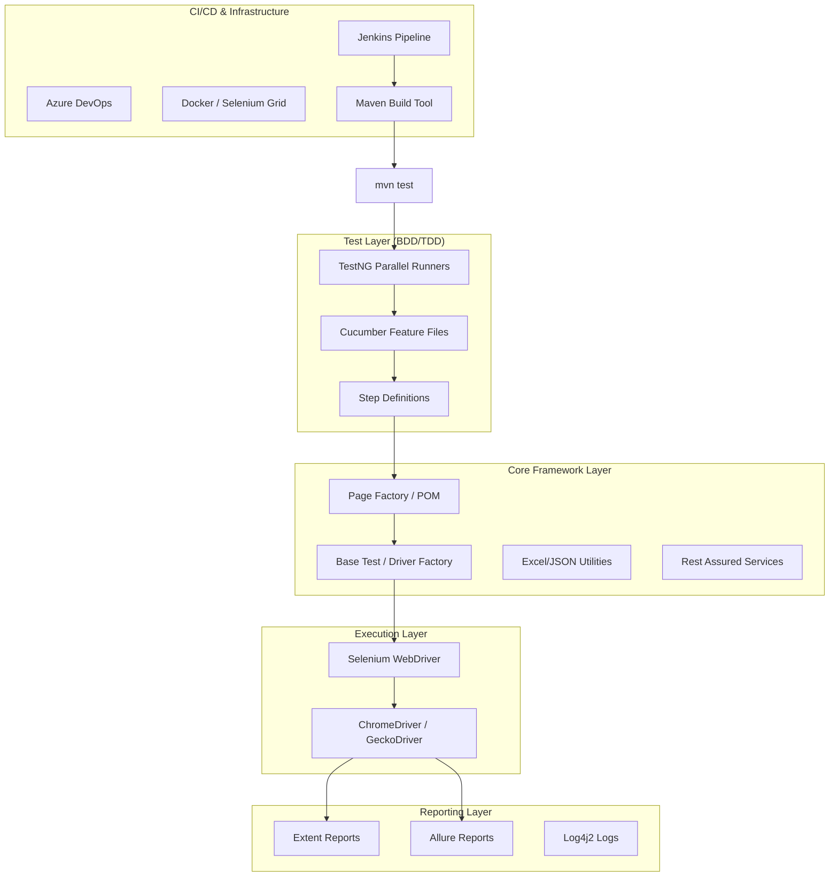
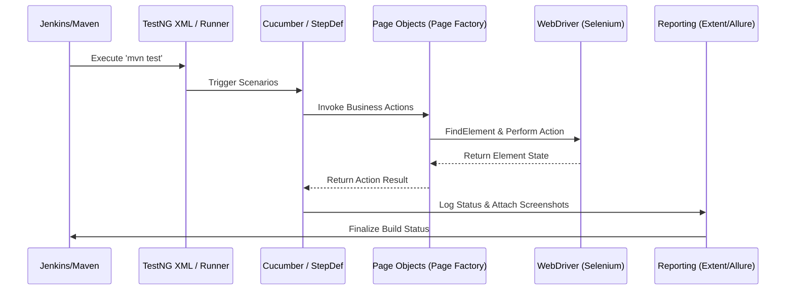

# Project Architecture: Selenium WebDriver + Java (Enterprise Framework)

This document provides a detailed walkthrough of an enterprise-grade automation framework using the Java/Selenium stack, structured for senior-level interview discussions.

## 1. Project Architecture Diagram

---

## 2. Execution Flow Diagram

---

## 3. High-Level Execution Flow
The framework is driven by **Maven**, which manages lifecycle phases and dependencies. Execution is triggered via `testng.xml` which points to **Cucumber Runners**. These runners scan the **Feature files** and map them to **Step Definitions**. The framework utilizes a **ThreadLocal WebDriver** to support safe parallel execution. Page objects are implemented using the **Page Factory** pattern to initialize elements lazily. Data is fed from **Excel (POI)** or **JSON** files. Upon completion, **Allure** and **Extent Reports** provide a visual dashboard with screenshots and logs provided by **Log4j2**.

---

## 4. Folder-by-Folder Detailed Explanation

### a) Project Root Level
*   **`pom.xml`**: Configuration for Maven, including versions for Selenium, Cucumber, TestNG, and Rest Assured.
*   **`testng.xml`**: Defines the test suite, parallelization modes (tests/classes/methods), and thread counts.
*   **`Jenkinsfile`**: Groovy script defining the Jenkins Pipeline stages.
*   **`Dockerfile`**: Sets up the Java/Maven environment and installs browsers for containerized execution.

### b) `src/main/java` Layer
*   **`base`**: Contains `BaseTest.java` and `DriverFactory.java`. Manages WebDriver initialization and cleanup.
*   **`pages`**: Implements the **Page Object Model**. Each class represents a web page and uses `@FindBy` annotations.
*   **`utils`**: Generic helpers like `ExcelReader`, `ConfigReader`, `Waits`, and `JavaScriptExecutor`.
*   **`api`**: Rest Assured logic including Request/Response specifications and model classes (POJOs).

### c) `src/test/java` Layer
*   **`runners`**: TestNG classes annotated with `@CucumberOptions` to link features and glue code.
*   **`stepdefinitions`**: The bridge between Gherkin logic and Page Object actions.
*   **`hooks`**: Handles `@Before` and `@After` annotations for browser management and screenshot capture.

---

## 5. UI Automation Flow (Selenium)
1.  **Initialization**: `DriverFactory` creates a new instance (e.g., ChromeDriver) wrapped in `ThreadLocal`.
2.  **Page Factory**: Page objects use `PageFactory.initElements(driver, this)` to avoid `NullPointerException` and optimize element finding.
3.  **Synchronization**: Custom `FluentWait` or `WebDriverWait` wrappers handle dynamic element loading.
4.  **Action**: Selenium interaction (e.g., `element.sendKeys()`) triggers the browser.

---

## 6. API Automation Flow (Rest Assured)
1.  **Setup**: Define `RequestSpecBuilder` for common headers and auth.
2.  **Execution**: `given().spec(requestSpec).body(payload).post(endpoint)`.
3.  **Validation**: Use `ValidatableResponse` to assert status codes and JSON paths (`then().statusCode(200)`).
4.  **POJO**: Convert JSON responses to Java objects for easy field validation.

---

## 7. Report Generation Flow
*   **Step 1**: TestNG execution generates an XML result file.
*   **Step 2**: Cucumber formatter creates a JSON file.
*   **Step 3**: Allure/Extent plugins read these files and generate an interactive HTML dashboard.
*   **Step 4**: Hooks capture screenshots as **Base64** or **Bytes** and attach them directly to the report in the `After` method.
