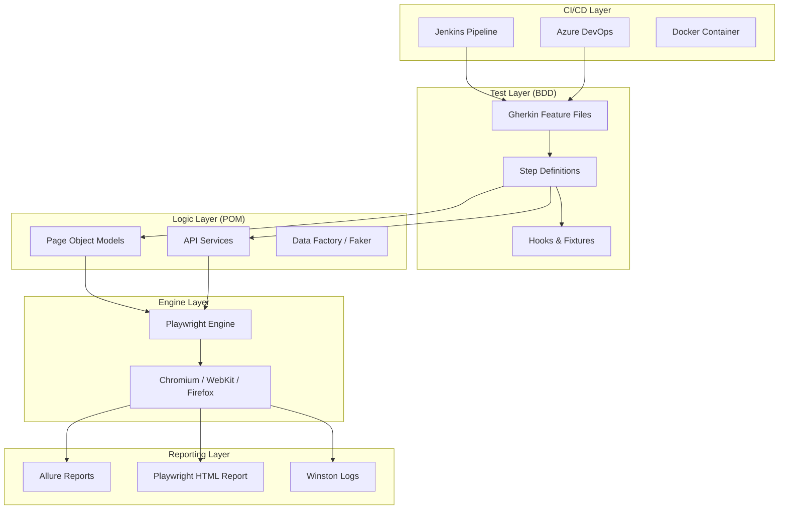
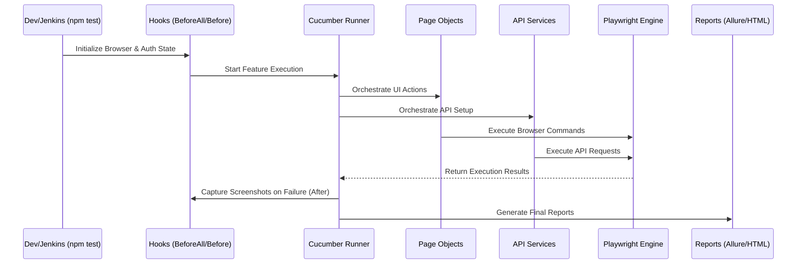

## 1. Project Architecture Diagram

---

## 2. Execution Flow Diagram

The execution is triggered either locally via **npm scripts** or automatically by **Jenkins/Azure DevOps** pipelines. **Cucumber-js** orchestrates the run by reading Gherkin feature files, which are mapped to **TypeScript step definitions**. These steps leverage **Page Object Models (POM)** and **API Service layers** to interact with the application. **Playwright** provides the underlying engine for browser interaction and API requests. Hooks manage the lifecycle (Browser initialization, Storage State login, and Teardown). Finally, results are aggregated into **Allure** and **HTML reports**, with logs and screenshots attached automatically upon failure.

---

## 2. Folder-by-Folder Detailed Explanation

### a) Project Root Level
*   **`playwright.config.ts`**: The central brain. Defines timeouts, browsers (Chromium, Firefox, WebKit), Reporters, and Global settings like `baseURL`.
*   **`package.json`**: Manages dependencies (`playwright`, `@cucumber/cucumber`, `faker`, `axe-code`) and defines execution scripts (e.g., `npm test`).
*   **`Jenkinsfile` & `azure-pipelines.yml`**: Define the CI/CD pipeline stages (Install, Build, Test, Report).
*   **`Dockerfile` & `docker-compose.yml`**: Instructions to containerize the entire execution environment for consistency.
*   **`.gitignore` / `.env`**: Security and environment configuration.

### b) `pages/` (Page Object Model Layer)
*   **Goal**: Encapsulation of UI elements and actions.
*   **Files**: `BookingPage.ts`, `ContactPage.ts`, `AdminPage.ts`.
*   **Logic**: Uses Playwright’s `Locator` API (e.g., `getByRole`) to find elements and defines `async` methods for business actions (e.g., `submitBooking()`). This prevents code duplication and makes maintenance easier.

### c) `steps/` (Step Definition Layer)
*   **Goal**: The "Glue code" between Gherkin and TypeScript.
*   **Files**: `bookingSteps.ts`, `contactSteps.ts`, `adminSteps.ts`.
*   **Logic**: Maps Gherkin sentences to Page Object methods. It holds no UI logic itself, only orchestration.

### d) `feature/` (Behavioral Layer)
*   **Goal**: Business requirements in plain English (Gherkin).
*   **Logic**: Contains `.feature` files with `Scenarios`, `Scenario Outlines`, and `Data Tables`. These files are accessible to non-technical stakeholders.

### e) `fixtures/` & `utils/` (Core Framework Layer)
*   **`hooks.ts`**: Handles `@BeforeAll`, `@Before`, `@After`. It initializes the Playwright `BrowserContext`, handles `@admin` tag auth via `storageState`, and captures screenshots on failure.
*   **`pageFixture.ts`**: A singleton-like object used to share the Playwright `page` instance across different step definition files.
*   **`DataFactory.ts`**: Uses **Faker.js** to generate randomized but realistic test data (Names, Emails) dynamically during execution.
*   **`Logger.ts`**: **Winston** configuration for structured logging (`execution.log`).

---

## 3. File-Level Flow Explanation (Step-by-Step)
Exectuion follows this exact sequence:
1.  **Trigger**: `npm test` runs the Cucumber-js command.
2.  **Hooks (BeforeAll)**: `hooks.ts` launches the Browser and generates `storageState.json` if missing.
3.  **Hooks (Before)**: Creates a fresh `BrowserContext` and `Page`. If the scenario has `@admin`, it applies the saved session.
4.  **Feature Reading**: Cucumber scans the `feature/` folder for scenarios matching the tags.
5.  **Mapping**: Cucumber finds the matching step in `steps/`.
6.  **Page Object Invocation**: The step definition calls a method in a `Page` class (e.g., `BookingPage.ts`).
7.  **Playwright Action**: Playwright performs the click/fill on the browser.
8.  **Assertion**: The step uses `expect(page)` to verify the UI state.
9.  **Hooks (After)**: On failure, a screenshot is taken. The browser context is closed.
10. **Report**: The output is written to `cucumber-report.json`, which Allure then processes into a visual dashboard.

---

## 4. UI Automation Flow
*   **Locators**: We prioritize user-facing locators (`getByRole`, `getByText`) over brittle CSS/XPath to ensure tests are resilient to UI changes.
*   **Auto-Waiting**: We leverage Playwright’s internal polling. We never use `hard waits`.
*   **Actionability**: Before clicking, Playwright ensures the element is visible, stable, and enabled.
*   **Example**: `BookingSteps` -> `BookingPage.fillBookingDetails()` -> `page.locator('#firstname').fill()` -> `expect(confirmation).toBeVisible()`.

---

## 5. API Automation Flow (Hybrid Strategy)
*   **API Service Layer**: `services/MessageAPI.ts` uses `request.post` to interact with backend endpoints directly.
*   **Request/Response**: We use `APIRequestContext` for speed.
*   **Scenario**: A test calls the API to create a message, then navigates the UI to the Admin Inbox to ensure it appears. This is "Hybrid Testing," which validates data integrity across the stack.

---

## 6. Data Driven Flow
*   **Faker.js**: `DataFactory.ts` generates unique records on-the-fly, ensuring no two tests collide.
*   **Scenario Outlines**: Gherkin `Examples` tables are used to iterate the same test logic with different payloads (e.g., valid vs invalid login).
*   **JSON/Env**: Environment-specific data (URLs, Credentials) are pulled from `.env.dev` files.

---

## 7. Parallel Execution Flow
*   **Worker Processes**: Playwright runs tests in multiple parallel workers by default.
*   **Isolation**: Each worker has its own `BrowserContext` (isolated cache/cookies), meaning the tests do not interfere with each other.
*   **Cucumber Parallel**: We use `@cucumber/parallel` or `playwright-bdd` strategies to split features across available CPU cores.

---

## 8. Report Generation Flow (End-to-End)
1.  **Test Completion**: Cucumber writes raw execution results into `reports/cucumber-report.json`.
2.  **Screenshots**: Saved to `reports/screenshots/` and embedded directly into the JSON/HTML output via hooks.
3.  **Logs**: Winston pipes execution logs to `reports/logs/execution.log`.
4.  **Allure Processing**: `allure-playwright` plugin captures metadata.
5.  **Final Output**: `npx allure generate` creates a searchable, trend-based web report showing pass/fail rates and failure videos.

---

## 9. CI/CD Flow
1.  **Trigger**: Code is pushed to Git.
2.  **Pipeline**: Azure/Jenkins pulls the **Dockerfile**.
3.  **Docker Build**: Creates an environment with Node.js and Playwright browsers.
4.  **Execution**: `npm test` runs inside the container.
5.  **Publish**: Test results are uploaded to the Azure Pipeline "Tests" tab or Jenkins Allure Dashboard.

---

## 10. Complete End-to-End Example: "Successful Booking"
1.  **Feature**: Scenario defined in `booking.feature`.
2.  **Step**: `When I enter "Jim" as first name` is mapped to `bookingSteps.ts`.
3.  **Page Object**: Step calls `bookingPage.fillBookingDetails("Jim", "Beam")`.
4.  **Browser**: Playwright finds the `First Name` input using `placeholder` and types the value.
5.  **Assertion**: Step calls `expect(page).toHaveURL(/confirm/)`.
6.  **Report**: Allure marks the step as "Passed" and moves to the next scenario.
